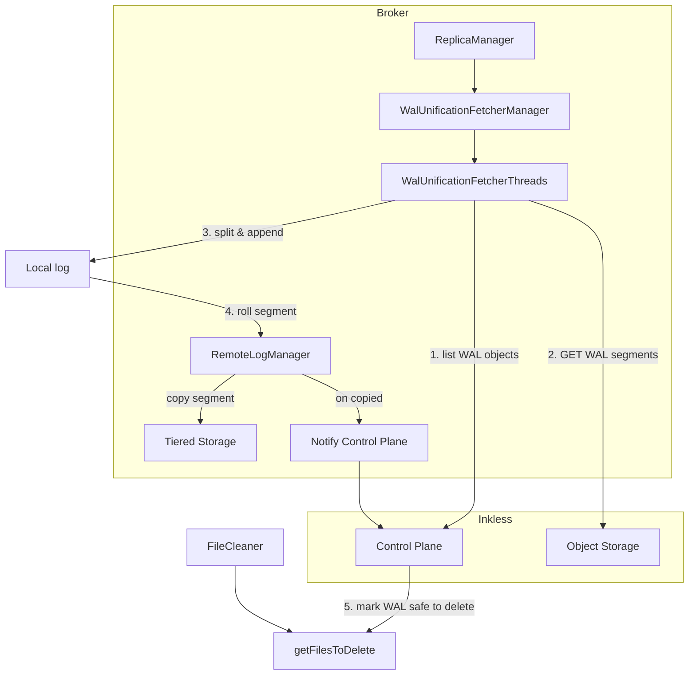

# WAL to tiered segments unification plan

## Current state

- **WAL segments**: Produced data is buffered and committed as objects (format `WRITE_AHEAD_MULTI_SEGMENT`) to object storage; batch metadata (topic, partition, base_offset, last_offset, byte_offset, etc.) is stored in the Control Plane (`[ControlPlane.commitFile](storage/inkless/src/main/java/io/aiven/inkless/control_plane/ControlPlane.java)`, `[FileCommitJob](storage/inkless/src/main/java/io/aiven/inkless/produce/FileCommitJob.java)`).
- **Replica fetchers**: `[ReplicaFetcherManager](core/src/main/scala/kafka/server/ReplicaFetcherManager.scala)` extends `[AbstractFetcherManager](core/src/main/scala/kafka/server/AbstractFetcherManager.scala)`; `[ReplicaFetcherThread](core/src/main/scala/kafka/server/ReplicaFetcherThread.scala)` extends `[AbstractFetcherThread](core/src/main/scala/kafka/server/AbstractFetcherThread.scala)` and fetches from a leader via `LeaderEndPoint`. Partitions are assigned by hash to a pool of threads keyed by `(brokerId, fetcherId)`.
- **Tiered storage**: `[RemoteLogManager](storage/src/main/java/org/apache/kafka/server/log/remote/storage/RemoteLogManager.java)` copies local segments via `copyLogSegment` → `RemoteStorageManager.copyLogSegmentData`, then `log.updateHighestOffsetInRemoteStorage(endOffset)`. No current hook to notify the batch coordinator.
- **Control Plane**: Exposes `getLogInfo` (logStartOffset, highWatermark, byteSize per partition), `listOffsets`, `findBatches`, `getFilesToDelete` (files in state `deleting`), `deleteFiles`. Files are marked for deletion by merge/delete-records/delete-topic logic; `[FindFilesToDeleteJob](storage/inkless/src/main/java/io/aiven/inkless/control_plane/postgres/FindFilesToDeleteJob.java)` returns them; `[FileCleaner](storage/inkless/src/main/java/io/aiven/inkless/delete/FileCleaner.java)` deletes from storage and calls `deleteFiles`.
- **Broker–Inkless**: `[SharedServer](core/src/main/scala/kafka/server/SharedServer.scala)` holds `inklessControlPlane`; `[BrokerServer](core/src/main/scala/kafka/server/BrokerServer.scala)` builds `inklessSharedState` and passes it into `[ReplicaManager](core/src/main/scala/kafka/server/ReplicaManager.scala)`. ReplicaManager already has `replicaFetcherManager` and `replicaAlterLogDirsManager` and creates them in `createReplicaFetcherManager` / `createReplicaAlterLogDirsManager`.

## Architecture (high level)

## 1. Feature flag and config

- **Add config** `diskless.ts.unification.enable` (default `false`):
  - In `[ServerConfigs](server-common/src/main/java/org/apache/kafka/server/config/ServerConfigs.java)`: new constant and `.define(...)` in `CONFIG_DEF`.
  - In `[KafkaConfig](core/src/main/scala/kafka/server/KafkaConfig.scala)`: `disklessTsUnificationEnable = getBoolean(ServerConfigs.DISKLESS_TS_UNIFICATION_ENABLE_CONFIG)`.
- **Add config** `diskless.ts.unification.fetchers` (default `4`): number of fetcher threads for unification. In ServerConfigs and KafkaConfig (`disklessTsUnificationFetchers`).
- When enabled, run unification; **do not** require tiered storage to be enabled (defer that check to a later step).

## 2. Control Plane API extensions (storage/inkless)

- **List WAL segments for partition (for fetcher)**  
New API, e.g. `listWalSegments(List<ListWalSegmentsRequest>)` where a request is `(topicId, partition, afterOffset)`. Response: list of WAL file identifiers (object key) with per-partition offset range (min/max offset for that partition in that file). Implementation: query batches + files where `files.format = WRITE_AHEAD_MULTI_SEGMENT`, filter by `topic_id`, `partition`, and `last_offset > afterOffset`, group by `file_id`/object_key, return object keys and for each the relevant (topic_id, partition, base_offset, last_offset) or at least (base_offset, last_offset) for the requested partition. This allows the fetcher to GET only WAL objects that contain data after the current unified offset.
- **Notify batch coordinator when a tiered segment is backed up**  
New API, e.g. `notifyTieredSegmentBackedUp(topicId, partition, startOffset, endOffset)` (or a batch variant). Control Plane records that this partition’s tiered log now includes [startOffset, endOffset]. **Store tiered offsets in a new table** (e.g. tiered end offset per topic_id + partition), updated on each notify.
- **Mark WAL files for deletion when fully covered by tiered**  
For each WAL file (WRITE_AHEAD_MULTI_SEGMENT), the batch coordinator can determine the maximum offset per (topic_id, partition) present in that file (from existing batches table). When, for every (topic_id, partition) in that file, the tiered end offset for that partition is >= that maximum, the WAL file can be marked for deletion (same mechanism as today: state → `deleting`, so it appears in `getFilesToDelete()` and is then deleted by FileCleaner). **Implemented in the notify path**: `[NotifyTieredSegmentBackedUpJob](storage/inkless/src/main/java/io/aiven/inkless/control_plane/postgres/NotifyTieredSegmentBackedUpJob.java)` updates the tiered_offsets table and then re-evaluates WAL files for that partition, marking fully covered files for deletion.
- **Bootstrap “earliest WAL offset”**  
For a partition, the fetcher needs to know “start fetching WAL from this offset.” Use existing `getLogInfo` (logStartOffset / highWatermark) for WAL-only view; for unification we need “next offset after consolidated log.” So the fetcher will use: **latest consolidated offset** = max(local log end offset, tiered log end offset). If no local log, use tiered only; if no tiered, use local only. Then “afterOffset” = that value; list WAL segments with `afterOffset` and fetch only WAL that contains offsets > afterOffset. No new “earliest WAL offset” API is strictly required if we define “consolidated” as above and list WAL with `afterOffset`.

## 3. Unification fetcher (broker / core)

**Chosen design: Option A**  
A dedicated fetcher and manager that do **not** extend `AbstractFetcherThread` or `AbstractFetcherManager`, and do not use a synthetic `LeaderEndPoint`.

- **Fetcher thread** (e.g. `WalUnificationFetcherThread` or `AbstractWalUnificationFetcherThread`): Does **not** extend `AbstractFetcherThread`. Extends `ShutdownableThread`. Owns partition state (per-partition fetch offset, topicId, leaderEpoch) and exposes `addPartitions(initialFetchStates)` and `removePartitions(partitions)` for the manager. Main loop in `doWork()`: no truncation; each iteration builds a fetch request from assigned partitions (topicIdPartition + fetchOffset), calls `[WalUnificationFetchHelper](core/src/main/java/kafka/server/WalUnificationFetchHelper.java).fetchFromWal(...)`, then for each partition with data calls the same append path (e.g. `Partition.appendRecordsToFollowerOrFutureReplica`, update high watermark, `replicaMgr.completeDelayedFetchRequests`). Never skip offsets.
- **Manager** (e.g. `WalUnificationFetcherManager` or `WalUnificationManager`): Does **not** extend `AbstractFetcherManager`. Holds a fixed pool of N worker threads (from config `diskless.ts.unification.fetchers`). Assigns partitions to threads by the same hash as replica fetchers: `Utils.abs(31 * topic.hashCode() + partition) % numFetchers`. Exposes `addFetcherForPartitions(Map[TopicPartition, InitialFetchState])` and `removeFetcherForPartitions(Set[TopicPartition])` so [ReplicaManager](core/src/main/scala/kafka/server/ReplicaManager.scala) can keep calling the same entry points (no change to ReplicaManager call sites). When adding partitions, use a single synthetic `BrokerEndPoint` (e.g. id -1) only for constructing `InitialFetchState`; internally the manager dispatches to the correct thread by fetcher id. Also expose `shutdown()` and `shutdownIdleFetcherThreads()` for existing ReplicaManager integration.
- **No `WalUnificationEndPoint`**: There is no `LeaderEndPoint` implementation for WAL unification. The fetcher thread calls `WalUnificationFetchHelper.fetchFromWal` directly.
- **Keep** `WalUnificationFetchHelper` unchanged: it already provides `fetchFromWal` with listWalSegments, findBatches, object fetch, WAL parsing, and overlapping-segment deduplication.
- **ReplicaManager integration**  
  - When unification is enabled and a diskless partition is created or becomes leader (or is assigned to this broker for diskless), ensure a local log exists (create if needed) and add the partition to the unification manager with `InitialFetchState(initOffset = max(localLogEnd, tieredLogEnd))`. Tiered log end: use existing `RemoteLogManager` / `RemoteLogMetadataManager.highestOffsetForEpoch` (or equivalent) when tiered storage is configured; if not, use only local or only Control Plane highWatermark for bootstrap.
  - No need to persist unification progress in the Control Plane beyond what is already there (local + tiered state and WAL batch metadata).

## 4. WAL parsing and append

- **GET WAL from object storage**  
Use existing Inkless storage backend `fetch(objectKey, range)` (e.g. `[ObjectFetcher](storage/inkless/src/main/java/io/aiven/inkless/storage_backend/common/ObjectFetcher.java)`, used by `[FileFetchJob](storage/inkless/src/main/java/io/aiven/inkless/consume/FileFetchJob.java)`). The unification fetcher runs in the broker (Scala/Java); it needs access to the same storage backend and object keys. This implies the broker must have access to Inkless `SharedState` (object fetcher + Control Plane), which it already does for diskless fetch/append.
- **Split WAL by partition**  
**WAL parsing is implemented in the broker** (core), in `WalUnificationFetchHelper`. The caller of the helper is the Option-A fetcher thread (not a synthetic leader). WAL format is multi-partition; batch metadata comes from Control Plane `findBatches` (batches by file/object key). For each partition: list WAL segments via `listWalSegments`, get batches per segment via `findBatches`, extract byte ranges, read records, build `MemoryRecords`, and append in offset order. **Overlapping segments**: when multiple WAL segments contain the same offset range (e.g. same batch in multiple files), only one copy is included: the helper tracks `nextOffsetNeeded` and adds a batch only if it contains that offset (`batch.baseOffset() <= nextOffsetNeeded && batch.lastOffset() >= nextOffsetNeeded`), then advances `nextOffsetNeeded = batch.lastOffset() + 1`. This avoids duplicate offsets and `OffsetsOutOfOrderException` when appending.
- **Append to local log**  
Use the same append path as replica fetcher: e.g. `log.appendAsFollower` or the internal equivalent so that segment rolling is driven by topic config (segment.bytes, segment.ms). Roll triggers when segment is full or time-based.

## 5. Segment roll and tiered backup notification

- **When a local segment is rolled**  
Existing Kafka log segment rolling (driven by `LogConfig` segment.bytes / segment.ms) already produces “closed” segments. The existing `RemoteLogManager` (RLM) copy task picks up segments and copies them to tiered storage. So: (1) Unification appends to local log → segment fills or time elapses → segment rolls. (2) RLM copies the closed segment to tiered storage and calls `log.updateHighestOffsetInRemoteStorage(endOffset)`.
- **Notify batch coordinator**  
After RLM successfully copies a segment, the batch coordinator must be notified so it can update “tiered end” per partition and eventually mark WAL files for deletion. Options:
  - **Callback/listener**: Add an optional “on segment copied to remote” listener (e.g. in `RemoteLogManager` or passed from broker). When copy completes, the broker invokes `ControlPlane.notifyTieredSegmentBackedUp(topicId, partition, segmentBaseOffset, segmentEndOffset)`. Implement this in the component that creates RLM or in a small bridge used only when unification is enabled.
  - **Polling**: A scheduled task that compares `log.highestOffsetInRemoteStorage()` with the last-notified offset and calls the Control Plane for new segments. Simpler but less precise and more latency.
  **Keep the RLM callback Inkless-specific**: register the "on segment copied" hook only when unification is enabled (in the component that creates or configures RLM for diskless/unification), not as a generic RLM extension. This avoids changing the upstream RLM contract for all users.

## 6. Delete WAL segments (batch coordinator side)

- After `notifyTieredSegmentBackedUp`, the Control Plane updates the tiered end offset for that (topic_id, partition). A job or the same notify path determines WAL files (WRITE_AHEAD_MULTI_SEGMENT) such that for every (topic_id, partition) present in the file, the max offset in that file for that partition is <= tiered end for that partition. Those files are marked for deletion (transition to `deleting`). Existing `getFilesToDelete` and `FileCleaner` then delete them from object storage and update the Control Plane.

## 7. Implementation notes and constraints

- **Local disk as cache**: Do not treat local log offsets as durable; only tiered offsets are “unified/consolidated.” Local segments can be removed at any time; bootstrap must always consider tiered end when local is missing or truncated.
- **Never skip offsets**: When appending from WAL to local log, enforce strict ordering and no gaps (same as replica fetcher).
- **Single source of truth for “consolidated”**: Use tiered (remote) log end when available; otherwise local log end for determining “afterOffset” for listing WAL. For bootstrapping/resume, rely on already unified local segments or remote segments only.

## 8. Testing

- **Control Plane**: Unit tests in `[AbstractControlPlaneTest](storage/inkless/src/test/java/io/aiven/inkless/control_plane/AbstractControlPlaneTest.java)` for `listWalSegments` (listWalSegmentsEmptyWhenNoWALData, listWalSegmentsReturnsSegmentsWithOffsetGreaterThanAfterOffset, listWalSegmentsUnknownTopicOrPartition), `notifyTieredSegmentBackedUp` (notifyTieredSegmentBackedUpUpdatesTieredEndOffset, notifyTieredSegmentBackedUpMarksWALFileForDeletionWhenFullyCovered, notifyTieredSegmentBackedUpDoesNotMarkWALFileWhenNotFullyCovered, notifyTieredSegmentBackedUpIgnoresUnknownTopicOrPartition).
- **Unification fetcher / helper**: Unit tests in `[WalUnificationFetchHelperTest](core/src/test/java/kafka/server/WalUnificationFetchHelperTest.java)` with mock Control Plane and mock ObjectFetcher: verify fetch from WAL returns partition data; verify **overlapping segments** return a single copy of the offset range (`fetchFromWalOverlappingSegmentsReturnsSingleCopyOfOffsetRange`) to prevent OffsetsOutOfOrderException; verify initial offset and ordering. Unit tests for the Option-A **fetcher thread and manager** (with mocks for helper and ReplicaManager) verify partition assignment, fetch loop, and append; no tests depend on `LeaderEndPoint` or `AbstractFetcherThread` for WAL unification.
- **Integration**: Test that with unification enabled, producing to a diskless topic results in WAL being consumed by the fetcher, appended to local log, segments rolled and copied to tiered storage, Control Plane notified, and WAL files eventually appearing in `getFilesToDelete` and deleted.

## File and component summary

| Area             | Files / components to add or change                                                                                                                                                                                                                                                                                                                                                                                                                  |
| ---------------- | ---------------------------------------------------------------------------------------------------------------------------------------------------------------------------------------------------------------------------------------------------------------------------------------------------------------------------------------------------------------------------------------------------------------------------------------------------- |
| Config           | `ServerConfigs.java` (`diskless.ts.unification.enable`, `diskless.ts.unification.fetchers`), `KafkaConfig.scala` (read both)                                                                                                                                                                                                                                                                                                                         |
| Control Plane    | New API: `listWalSegments`, `notifyTieredSegmentBackedUp`; `NotifyTieredSegmentBackedUpJob` updates tiered_offsets and marks WAL files for deletion when fully covered                                                                                                                                                                                                                                                                               |
| Control Plane DB | **New table** `tiered_offsets` (tiered_end_offset per topic_id + partition); migration V11.                                                                                                                                                                                                                                                                                                                                                          |
| Broker / core    | `WalUnificationFetchHelper`, `WalUnificationFetcherThread` (Option A: extends ShutdownableThread, not AbstractFetcherThread), `WalUnificationFetcherManager` (Option A: does not extend AbstractFetcherManager); no WalUnificationEndPoint. ReplicaManager creates manager and adds partitions when unification enabled; RLM “segment copied” → `ControlPlane.notifyTieredSegmentBackedUp` (BrokerServer, Inkless-specific when unification enabled) |
| Broker / core    | WAL parsing/splitting in `WalUnificationFetchHelper` (listWalSegments, findBatches, ObjectFetcher); overlapping segments deduplicated by nextOffsetNeeded. RLM callback: Inkless-specific.                                                                                                                                                                                                                                                           |
| Tests            | Control Plane: `AbstractControlPlaneTest` (listWalSegments, notifyTieredSegmentBackedUp, mark-for-deletion). Fetcher: `WalUnificationFetchHelperTest` (fetch from WAL, overlapping segments single copy). Integration test for full unification and WAL deletion.                                                                                                                                                                                    |

## Resolved design choices

1. **Control Plane tiered offsets**: Stored in **table `tiered_offsets`** (not derived from existing tables).
2. **WAL parsing**: Implemented **in the broker** (core) in `WalUnificationFetchHelper`; uses Control Plane `listWalSegments` and `findBatches` plus `ObjectFetcher` to get byte ranges per partition for each object.
3. **RLM callback**: **Inkless-specific** — register “on segment copied” only when unification is enabled (in BrokerServer); do not add a generic listener to upstream RLM.
4. **Overlapping WAL segments**: When multiple WAL segments contain the same offset range, only one copy is included (track `nextOffsetNeeded`, include batch only if it contains that offset) to avoid duplicate appends and `OffsetsOutOfOrderException`.
5. **Unification fetcher design**: **Option A** — dedicated fetcher thread and manager that do **not** extend `AbstractFetcherThread` / `AbstractFetcherManager`. The fetcher owns partition state and a simple doWork loop (list WAL → GET → parse → append via helper and ReplicaManager). No synthetic `LeaderEndPoint`; `WalUnificationEndPoint` is removed.

