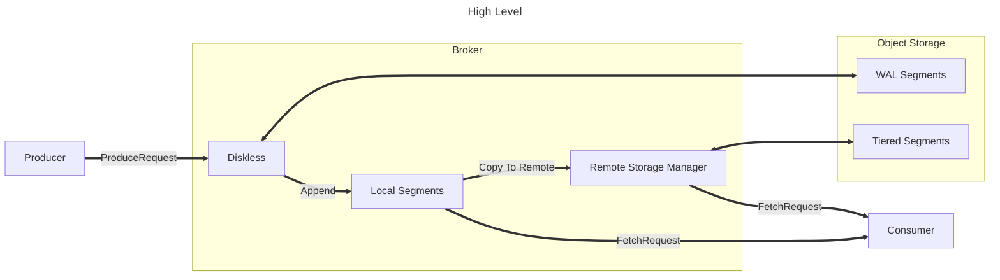
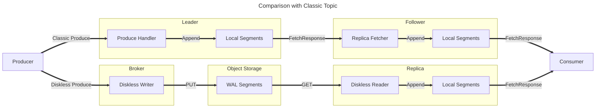
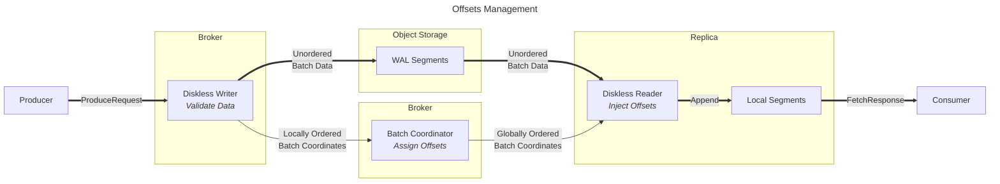
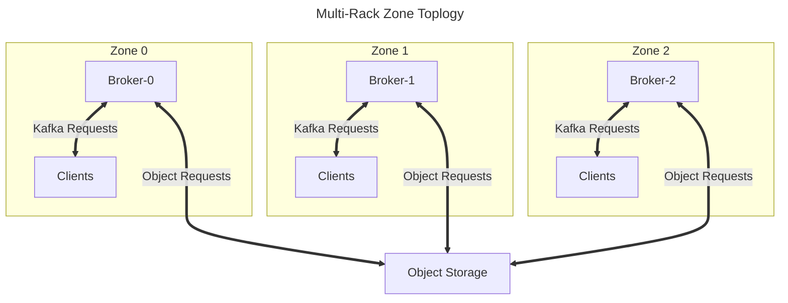

# Inkless Architecture

Diskless topics primarily change how new data is written to Kafka.
Existing mechanisms for serving data are largely unaffected, including the use of Tiered Storage.

Diskless topics change how ProduceRequests are translated to appends on each replica.

For Classic topics, Produce requests trigger an append to the leader's local segments.
Followers issue FetchRequests to the leader, which are served from the leader's local segments.
Followers then append this data to their local segments.

For Diskless topics, Produce requests trigger a PUT to Object Storage.
Replicas issue  GETs to the Object Storage to retrieve batch data.
Diskless then appends batches to the local segments on the replica.

# Offsets Management

Data from ProduceRequests is written to object storage without assigning offsets.
Multiple ProduceRequests from multiple clients may be combined together into a single object to reduce the number of object writes.
The batch metadata (topic, partition, etc.) and location of the data (object ID & extent) are sent to the batch coordinator to be committed in a linear order.

Appending to replicas is done by querying the Batch Coordinator to find upcoming batch metadata for the requested partitions. 
For each object containing needed data, the object is read from object storage and then split by partition.
Offsets for the returned data are inserted from the batch metadata, and the data is appended to the local segments. 
Once the data lands in the local segments, it is available for consumers to read.

# Zone Topology

Inkless is designed to be deployed in a non-uniform network environment, where there is a cost incentive for keeping data transfers local.
A single cluster which is deployed in multiple zones may produce in one zone and consume in another, while:

* Preserving global order consistency
* Durably storing data and metadata
* Avoiding cross-zone data transfers
* Serving multiple consumers at a low marginal cost

When a cluster is deployed in multiple racks/zones, one replica should be placed in each zone for each Diskless topic.
This will permit all Kafka requests from rack-aware clients to be directed to the local zone replica, avoiding cross-zone charges for client traffic.
Each broker will request objects from object storage independently, and these requests for object data will also not incur cross-zone charges

