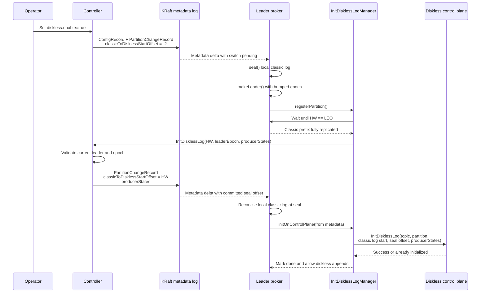

# Classic to Diskless Switch Protocol

This document describes the implementation flow for switching a classic Kafka topic to diskless storage. The switch is driven by metadata records: the controller first marks each partition as switch-pending, the leader seals the local classic log and asks the controller to commit the final start offset, then the broker initializes the diskless log on the control plane from the committed metadata.

## Requirements and Guarantees

The switch protocol is designed with the following guarantees and constraints:
* **Online Switch:** The switch is performed online. Producers are blocked only while a partition is sealed but not yet initialized for diskless writes.
* **Zero Data Loss:** The leader waits until the High Watermark (HW) reaches the Log End Offset (LEO) before committing the diskless start offset.
* **Configuration Constraint:** Switching is only supported for topics where unclean leader election is **not enabled**.

The Kafka controller participates in the switch to fence stale leaders. The broker proposes the final start offset, but the controller persists it only if the request comes from the current leader epoch and the current partition leader.

## `classicToDisklessStartOffset` States

`classicToDisklessStartOffset` is a per-partition `long` field on the controller/broker in-memory metadata image (`PartitionRegistration`). It serves two purposes at once:

* As a **boundary**, it marks the first offset owned by diskless storage. The classic log owns every offset below it; diskless storage owns everything at or above it.
* As a **state machine**, it drives the switch flow. Two negative values are used as sentinels, and any non-negative value is the committed boundary:

| Value | Constant | Meaning |
| --- | --- | --- |
| `-1` | `NO_CLASSIC_TO_DISKLESS_START_OFFSET` | No classic-to-diskless switch offset has been committed (the default for classic and born-diskless partitions). |
| `-2` | `CLASSIC_TO_DISKLESS_SWITCH_PENDING` | The switch has started and the classic log must be sealed, but the final diskless start offset has not been committed yet. |
| `>= 0` | — | The committed seal offset. This is the first offset owned by diskless storage; the classic log owns offsets below it. |

### How it is stored

The switch state lives in the KRaft metadata log, but `classicToDisklessStartOffset` is **not** part of the upstream Apache Kafka record schemas (`PartitionRecord`, `PartitionChangeRecord`). To avoid forking those schemas, it is carried as an **unknown tagged field** (`RawTaggedField`) attached to the standard records:

* **High tag numbers (100+).** `classicToDisklessStartOffset` uses tag `100` (`CLASSIC_TO_DISKLESS_START_OFFSET_TAG`). The 100+ range is reserved to avoid colliding with upstream tagged fields. Because the tag is unknown to vanilla Kafka, it is **silently skipped** when read by an upstream broker, which keeps the on-disk metadata format compatible in both directions. Two sibling fields ride along on the same record using the same mechanism: producer states (tag `101`) and the diskless leader epoch (tag `102`).
* **Custom serde in `InitDisklessLogFields`.** The value is encoded by hand into the tagged field's raw byte payload: a single big-endian `int64` (8 bytes) written via `ByteBuffer.putLong`, and read back via `ByteBuffer.getLong`. There is no generated message class for it.
* **Sentinel is normally not serialized.** When `classicToDisklessStartOffset == -1`, automatic paths (`toRecord()` snapshots and ordinary change records) omit the tag entirely to save space; on read, an absent tag decodes back to `-1` (`NO_CLASSIC_TO_DISKLESS_START_OFFSET`). The one exception is the operator seal/abort path, which encodes an explicit `-1` to actively reset a sealed partition back to classic (see [Operator override](#operator-override-of-the-seal-offset)).
* **Replay and merge.** On load, `PartitionRegistration` decodes the tag from `PartitionRecord.unknownTaggedFields()`; `merge(PartitionChangeRecord)` applies updates from change records and carries the existing value forward when a change record **omits** the tag; `toRecord()` re-encodes it. Crucially, "tag omitted" and "tag explicitly set to `-1`" are distinguished at decode time (`decodeClassicToDisklessStartOffsetIfPresent` returns an empty `OptionalLong` only when the tag is absent): an omitted tag keeps the existing value, while a present tag — including an explicit `-1` — is applied verbatim. This is how the value survives metadata-log replay and propagates to brokers via metadata deltas, and how an operator can abort a switch.

## Protocol Steps

### Step 1: Mark the Switch as Pending

When `diskless.enable` changes from `false` to `true`, the controller emits the topic config update and one `PartitionChangeRecord` per partition in the same atomic write. Each partition change sets:

* `classicToDisklessStartOffset = -2`
* `leader = current leader`

Setting the leader to the current leader bumps the leader epoch, which forces the leader broker to process a `makeLeader` transition even when leadership did not otherwise change. Brokers rely on receiving the config change and the pending marker in the same metadata delta.

### Step 2: Seal the Classic Log

When a leader broker applies the metadata delta for a diskless topic with `classicToDisklessStartOffset = -2`, it seals the existing local `Partition` before calling `makeLeader`.

Sealing happens under the `leaderIsrUpdateLock` write lock. If there are undecided transactions, the broker aborts them first; then it marks the partition sealed. Once sealed, `appendRecordsToLeader` rejects classic produce requests with `ReplicaNotAvailableException`, so the local LEO cannot increase.

If the metadata delta also elects a new leader for the partition, the new leader seals before it is placed in the leader role. This prevents the new leader from accepting classic writes during the switch.

### Step 3: Propose the Final Start Offset

After sealing, the leader registers the partition with `InitDisklessLogManager`. The manager waits in `WaitingForReplication` until:

* the partition is still sealed
* the local log exists
* `HW == LEO`

Once HW catches up to LEO, the partition moves to `SendingToController`. The broker batches ready partitions and sends `InitDisklessLog` to the controller with:

* `disklessStartOffset = HW`
* `leaderEpoch = current partition leader epoch`
* `producerStates = active producer state extracted from the local log`

At this point `HW == LEO`, so the proposed start offset is the sealed LEO and is safely replicated to the ISR.

### Step 4: Persist the Final Start Offset

The controller handles `InitDisklessLog` as a serialized write operation. For each partition, it validates that:

* the request leader epoch is not stale
* the requesting broker is the current leader
* the proposed `disklessStartOffset` is non-negative
* the partition has not already committed a final `classicToDisklessStartOffset`

If validation succeeds, the controller writes a `PartitionChangeRecord` containing the final `classicToDisklessStartOffset` and the producer states. These values are encoded as tagged fields on the partition change record.

If the broker is stale, the controller rejects the request. A lower leader epoch is a permanent failure for that broker's attempt; retriable controller or transport failures are retried by the broker.

### Step 5: Initialize the Diskless Log

After the final offset is committed to the metadata log, brokers receive a new metadata delta with `classicToDisklessStartOffset >= 0`. The local leader then initializes the diskless log on the control plane using the authoritative data from metadata, not the earlier controller response.

The leader calls the control-plane `InitDisklessLog` API with:

* topic ID, topic name, and partition
* local classic log start offset
* committed `classicToDisklessStartOffset`
* committed producer states

Control-plane initialization is batched and retried on transient failures. An `INVALID_REQUEST` response from the control plane is treated as success because it means the diskless log is already initialized.

Once control-plane initialization succeeds, `InitDisklessLogManager` marks the partition done and removes it from tracking. Produce requests can then use the diskless append path from the committed start offset onward.

## Additional Behavior

Followers also seal during the switch. While the switch is pending (`-2`), they keep using the classic fetcher to replicate the frozen classic prefix. After the final start offset is committed, followers continue until their local LEO reaches the committed seal offset, then hand off from the classic prefix.

When a broker applies a newly committed seal offset, it reconciles the local classic log:

* if local LEO is above the seal, it truncates to the seal because offsets at and above the seal belong to diskless storage
* if a leader's local LEO is below the seal, it marks the partition offline because the classic prefix is incomplete

If leadership changes while the switch is pending, the new leader seals and re-drives the `InitDisklessLog` controller request. If leadership changes after the final offset is committed, the new leader skips the controller step and initializes the control plane directly from metadata.

## Operator override of the seal offset

The normal flow above is leader-driven: the broker proposes the seal offset and the controller validates it. For recovery and manual intervention, the `kafka-topic-switch.sh seal` operator command can override the seal state of a single partition directly, without being the partition leader. It is backed by the `AlterDisklessSwitch` controller RPC (admin → controller, authorized as `ALTER` on the cluster), which writes a `PartitionChangeRecord` carrying the requested `classicToDisklessStartOffset`. It is a recovery tool for a topic that is being switched, not a way to start a switch, so the controller rejects it unless the topic already has `diskless.enable=true`.

* **`>= 0`** forces (re-)sealing at that offset. The controller also captures the current leader epoch as the diskless leader epoch, exactly as the leader-driven commit does, so consolidation truncation stays correct. Unlike `InitDisklessLog`, this is accepted even when the partition has already committed a seal offset, so an operator can correct a bad seal.
* **`-1`** aborts the switch and reverts the partition to classic. The tag is written explicitly (see [How it is stored](#how-it-is-stored)) so that `merge` resets the value rather than treating the record as "unchanged". The controller also emits a `ConfigRecord` turning `diskless.enable` back off; since that config is topic-level, aborting one partition reverts the whole topic to classic.
* **`-2`** re-arms the switch as pending and re-sets the leader to bump the leader epoch, forcing the broker to seal again — the same mechanism as the initial switch-pending mark.

Because a negative offset means the partition is not switched, `merge` also drops the dependent switch metadata (producer states + the diskless leader epoch) whenever an explicit negative `classicToDisklessStartOffset` is applied. This prevents stale state from a previous completed switch surviving an abort or re-arm; the next `InitDisklessLog` flow re-captures both.

The command validates before committing: for a concrete (`>= 0`) seal it requires the seal offset to be at or below the partition end offset, as a sanity bound so a seal cannot point past the end of the log. The end offset is read via `listOffsets(LATEST)`, which returns the leader's log end offset, not the replication high watermark — it does not by itself prove every in-sync replica has replicated up to the seal. The `--dry-run` flag performs this validation and reports the action without writing anything.
