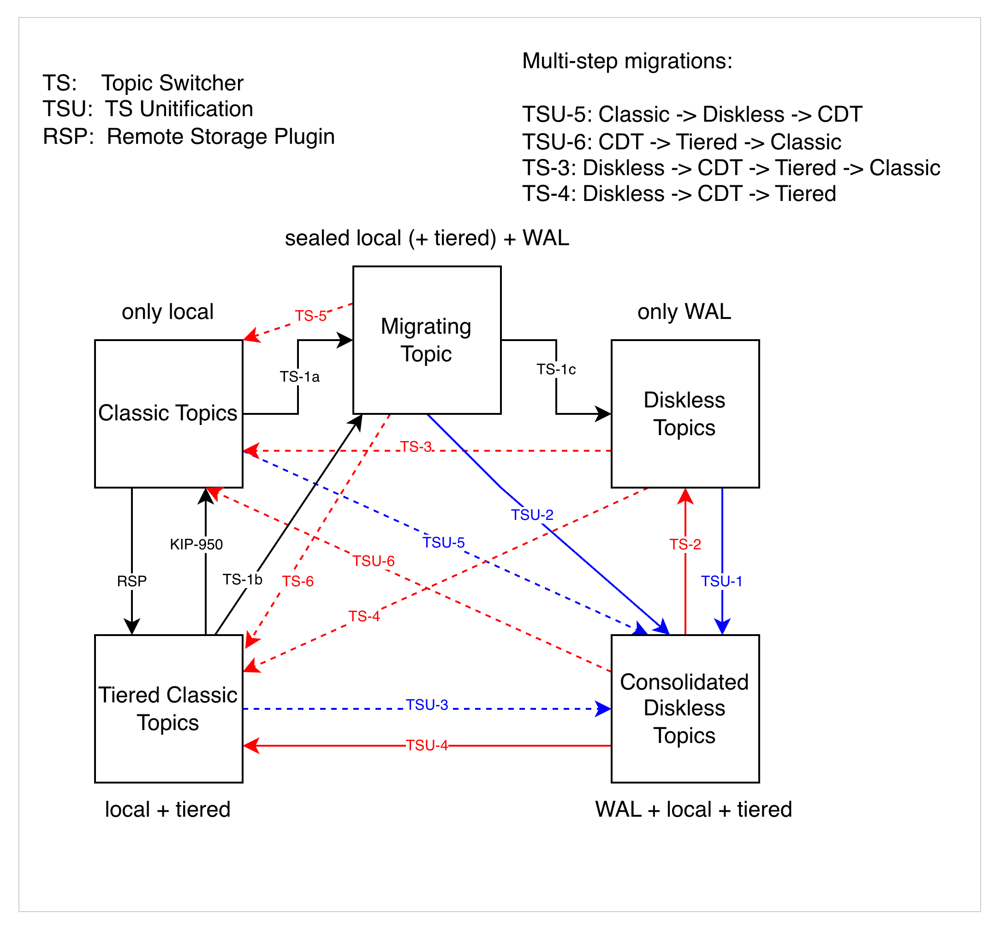
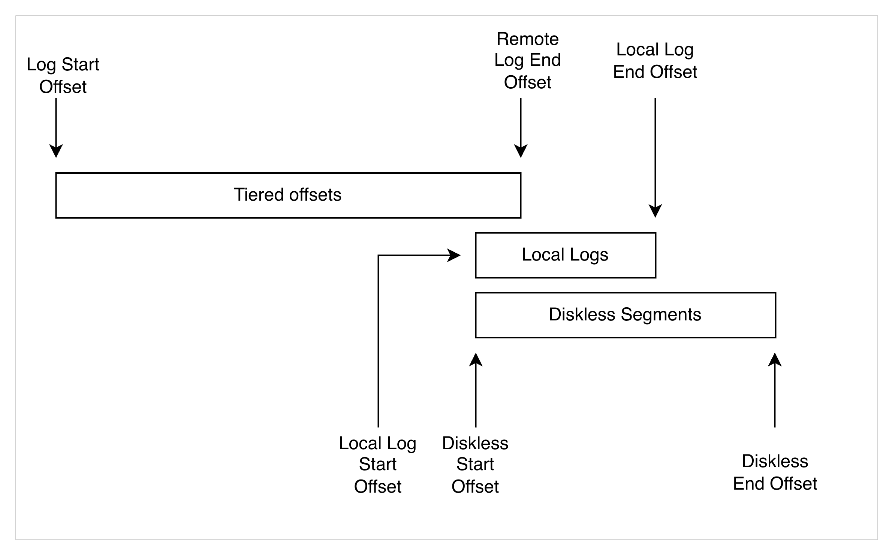
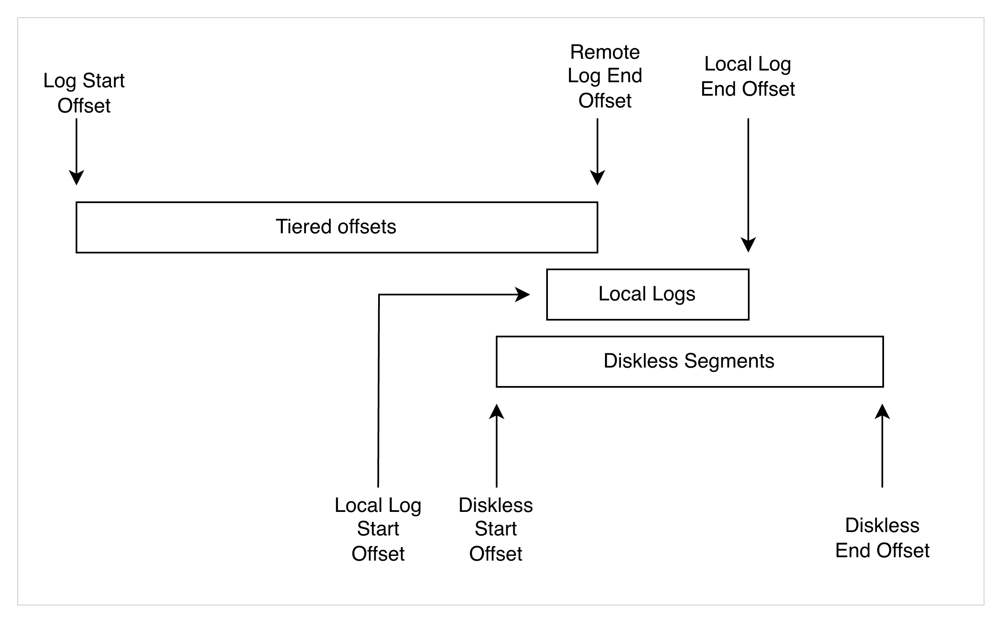
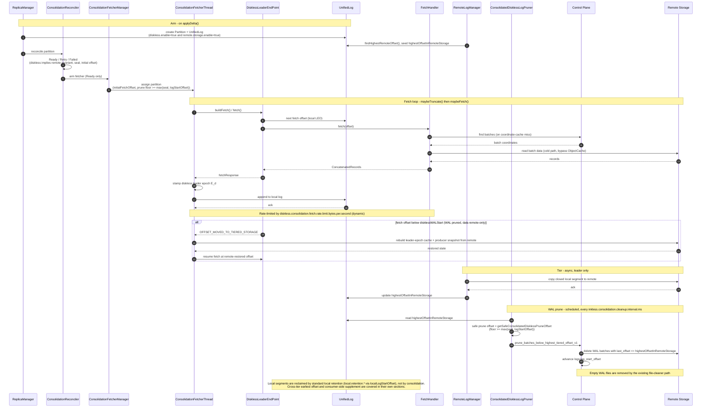
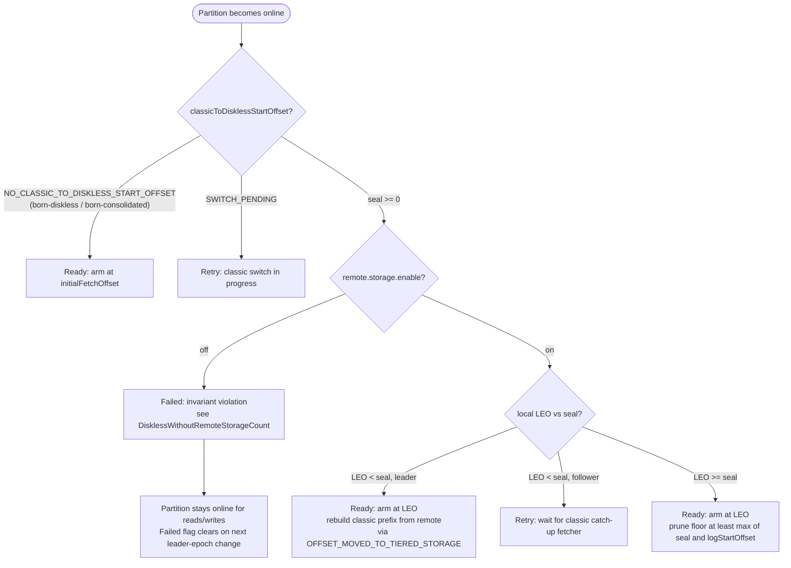

# Tiered Storage Consolidation for Diskless Topics

Tiered Storage Consolidation (TS consolidation, internally "TS unification") continuously
distills diskless Write-Ahead Log (WAL) segments into classic Kafka log segments and tiers
them to remote storage. The result is a *consolidated diskless topic* (CDT): a topic that
writes through the diskless fast path but reads like a tiered topic, with the diskless WAL
acting as a temporary buffer rather than long-term storage.

A consolidated diskless topic has both `diskless.enable=true` **and**
`remote.storage.enable=true`. The classic-to-diskless switch sets both atomically (see
[Classic to Diskless Switch](CLASSIC_TO_DISKLESS_SWITCH.md)), so a switched or born-consolidated
topic is always consolidating.

The feature is implemented and gated behind the `diskless.remote.storage.consolidation.enable` 
broker flag (which itself requires `diskless.allow.from.classic.enable=true`, managed replicas, 
and `remote.log.storage.system.enable=true`).


## Motivation

In a diskless topic the brokers create WAL files to store partition data and nothing more.
These files are write-optimized segments that collect multiple partitions' data together.
While these files are very good and cost-efficient for writing, they perform worse for reads,
because extra compute power is required to piece together a continuous stream of partition
data. Classic Kafka mechanisms also expect Kafka log segments to be read and written.

Transforming the WAL segments back into the Kafka log format removes burden from the
diskless coordinator, provides better read performance, and keeps the expected log format.

## Migration Paths

Migration between classic and diskless topics has several sub-cases, shown below. This
document covers TSU-1/2 (and the transitive TSU-3/5); the other paths are handled by the
[topic switch](CLASSIC_TO_DISKLESS_SWITCH.md) and the upstream tiered-storage framework.



- **TSU-1/2** (in scope): a diskless or migrating topic switches to a Consolidated Diskless
Topic.
- **TSU-3/5** (in scope): the transitive path from classic or tiered topics through
migrating/pure-diskless to CDT, enabled by TSU-1/2 plus the classic-to-diskless switch.
- **TS-2 / TSU-4** (out of scope): disabling consolidation to revert a CDT to a pure
diskless topic. CDT is a terminal state.
- **TS-4** (out of scope): a diskless→classic topic switcher. TS consolidation is a
subprocess of that larger problem, but solves a different problem.
- **Classic → Tiered**: already implemented by the remote storage framework.
- **Tiered → Classic**: will be implemented by KIP-950.


## High-Level Architecture


### General Read-Write

The primary assumption is that diskless topics have leaders. Leadership and followers give
useful locality and caching guarantees. In a scenario where all brokers are replicas,
interconnectedness is high and the cache is inefficient (one replica is cached on all
brokers in the worst case). The other extreme, a single replica, is also suboptimal: while
it may work in smaller single-region and on-prem installations, it would incur extra
cross-region costs to fetch from the leader.

The optimal scenario is similar to the well-known Kafka fetcher mechanism. A leader replica
handles produce traffic and replication. Consume traffic can be handled by the leader or by
followers (in a follower-fetch case). Interconnectedness is relatively low, cross-region
traffic is avoided (or pushed to bucket-side replication), and caching is more efficient
because cached segments are stored only where they are read.

### Consolidation Pipeline

In the produce flow, WAL segments are stored in object storage by the diskless coordinator
and stay there until `log.local.retention.ms` elapses, after which they are cleaned up.

In the consolidation architecture, a fetcher-based component reads the oldest batches from
the diskless WAL (by order of insertion, to preserve ordering) and appends them to a
per-partition `UnifiedLog` via the `Partition` class. The `RemoteLogManager` then copies
those local segments to remote storage, exactly as it does for a classic tiered topic. Once
a batch is confirmed in remote storage, the corresponding WAL data is pruned.

Consolidation pipeline: interleaved WALs are split into per-partition local segments and tiered to remote storage

The consolidation pipeline is implemented as a specialized replica-fetcher that pulls from
the diskless tier (object storage + control plane) instead of from a leader broker. See
[Implementation](#implementation) for the component breakdown.

### Log Continuity

In Kafka tiered storage, tiered and local offsets can overlap, as defined by KIP-405. The
separation between diskless and classic local offsets is similar: in the usual scenario
diskless offsets overlap local offsets, because the local log is treated as a cache, not as
persistent storage.



Depending on the cleanup schedule, diskless logs may totally overlap local logs and even
reach deeper into the tiered offset range. This happens when older segments contain data
which has not yet been migrated to remote storage, so it cannot be deleted.



This is not a problem, because diskless segments are cleaned up periodically as they are
consolidated. The offset concepts in play are:


| Concept                                       | Where it lives                                                        | Meaning                                                                                                                                             |
| --------------------------------------------- | --------------------------------------------------------------------- | --------------------------------------------------------------------------------------------------------------------------------------------------- |
| Log start offset                              | `UnifiedLog.logStartOffset`                                           | The start of the whole (tiered + local) log. Advanced by RLM as remote segments are deleted.                                                        |
| Log end offset (LEO)                          | `UnifiedLog.logEndOffset`                                             | The end of the local consolidated log.                                                                                                              |
| Local log start offset                        | `UnifiedLog.localLogStartOffset`                                      | Used for local retention; decides which local segments to delete.                                                                                   |
| Local log end offset                          | `UnifiedLog.logEndOffset`                                             | The consolidation frontier: offsets up to here have been materialized locally; the fetcher copies offsets above this from the diskless tier.        |
| Classic-to-diskless start offset (the *seal*) | `PartitionRegistration.classicToDisklessStartOffset` (KRaft metadata) | For a switched topic, the boundary between the classic prefix `[0, seal)` and the diskless region `[seal, LEO)`. Born-diskless topics have no seal. |
| Diskless WAL start                            | control plane `logs.log_start_offset`                                 | The WAL prune frontier: the first surviving WAL record. Advanced by the pruner as batches are confirmed in remote storage.                          |
| Diskless end offset                           | the diskless LEO                                                      | The end of the diskless WAL; effectively the produce high-watermark.                                                                                |


### Read Path

With consolidation, a consumer fetch may be served from three sources:

- **Tiered offset space**: classic log segments on remote storage (`[0, highestOffsetInRemoteStorage]`).
- **Diskless offset space**: WAL segments on remote storage.
- **WAL cache**: a local in-broker cache (a subset of the diskless offset space).

Routing for a consolidating partition, in `ReplicaManager.fetchMessages`:

- If the fetch offset falls in the tiered range (below `localLogStartOffset`), the request
routes to the `RemoteLogManager`, as for any tiered topic.
- If the fetch offset is within the local log, the local log is read. If the local read does
not satisfy `minBytes`, the broker **supplements** with a synchronous diskless fetch
starting at the local log end offset and merges the two via `ConcatenatedRecords.concat`
(see [Consumer-side supplement](#consumer-side-supplement)). This avoids parking the
consumer in the delayed-fetch purgatory at the local/diskless boundary when diskless data
is already available.
- If the fetch offset is at or beyond the local log end offset, the request is served from
the diskless subsystem (cache or object storage).

For all-consolidating requests the supplement is applied inline and the response is produced
immediately. For mixed requests (consolidating + pure-diskless) the supplement and the
diskless fetch run concurrently in `DelayedFetch.onComplete`, so the latency is the slower
of the two, not their sum.

#### Consumer-side supplement

```
consumer fetch (offset O, minBytes M)
   |
   +-- read local log [O, localLEO)
         |
         +-- bytes returned < M and O+read reached localLEO?
               |  yes
               +-- synchronous diskless fetch from localLEO
               +-- merge local ++ diskless via ConcatenatedRecords
               +-- return (HW/LSO taken from the diskless supplement)
         |  no (still inside local log, or error)
         +-- return local result
```

The supplement starts where the local read left off (not at a fixed boundary), and only
fires once the local log is exhausted up to `localLEO`. Supplementing from below the seal
would stitch the local prefix directly onto the diskless range and silently drop the
committed range `[supplementStart, seal)`, so it is deliberately suppressed there.

#### Reading from remote after the WAL is pruned

Once a batch is consolidated to remote and the WAL is pruned, the data below the diskless
WAL start lives *only* in the remote tier. If a fetch (e.g. after local-log loss, or a
follower catching up) targets an offset in `[logStartOffset, disklessWALStart)`,
`DisklessLeaderEndPoint.fetch` signals `OFFSET_MOVED_TO_TIERED_STORAGE` (clearing the
records). The stock Kafka tier-state machine then rebuilds the leader-epoch cache and
producer snapshot from remote before resuming the WAL fetch.

This is the core read-from-remote path for consolidated topics: it is what makes a
consolidated topic survive losing every local copy.

#### Followers

Followers must never replicate diskless records into their local log. When a partition has
fully switched and a follower fetches at or beyond the seal, `fetchMessages` returns an
empty response with the high watermark clamped to the seal, so the classic fetcher loop
sees the partition as caught up and goes idle. The follower keeps its classic local prefix
intact and can still serve consumer reads from it. The consolidation fetcher (below) is the
component that materializes the diskless region into the local log; it runs on managed
replicas only.

### Cross-tier log start offset

A born-consolidated topic's earliest readable offset eventually lives only in the remote
tier: the diskless WAL is pruned and local segments are evicted, yet `ListOffsets(EARLIEST)`
must still point at real data. When `retention.ms` expires the oldest remote segments, only
the partition's classic leader observes the earliest offset advancing: its
`RemoteLogManager` raises `UnifiedLog.logStartOffset` as it deletes them. That value is
broker-local: followers fetch from the diskless WAL and never learn it, and the control
plane's `log_start_offset` tracks only the WAL prune frontier, not the remote-retention
frontier. Without this feature, `ListOffsets(EARLIEST_TIMESTAMP)` (`--time -2`) served by
any non-leader broker returned a stale `0`, pointing consumers at data that no longer
exists. `EARLIEST_LOCAL_TIMESTAMP` (`--time -4`) is intentionally unaffected; it must keep
returning the diskless WAL log start.

The leader is the only participant that *knows* the cross-tier earliest offset, but any
broker must be able to *serve* it. The design makes the **control plane the source of
truth**, with a short-TTL cache:

- **Write path (leader).** `CrossTierLogStartReporter` buffers per-partition updates, drops
  non-advancing ones, coalesces, and flushes to the control plane once a second
  (write-through to the cache on success). It is triggered from the RLM callback in
  `BrokerServer`/`ReplicaManager` on the leader, and is a no-op for non-consolidating/classic
  topics and for strictly negative offsets. `0` is meaningful and *is* reported: it is the
  cross-tier earliest of a freshly-tiered born-consolidated topic whose WAL prune frontier
  has advanced above it.
- **Read path (any broker).** `FetchOffsetHandler` serves `EARLIEST` on a consolidating
  diskless topic read-through the `CrossTierLogStartCache` first; on a miss it queries the
  control plane and populates the cache. `DisklessFetchOffsetRouter` routes `EARLIEST` for
  **every** consolidating partition (born-consolidated and switched alike) to this
  control-plane leg — never to the broker-local classic log. This is required for
  correctness under managed replicas: `InklessTopicMetadataTransformer` advertises a
  hash-selected replica (usually a *follower*) as the partition leader, and a follower's
  local classic log start is frozen at the switch, so serving `EARLIEST` from it would pin
  the client-visible earliest at a stale value (e.g. `0` after a `DeleteRecords` the follower
  never applied). The control-plane value is broker-agnostic, so every broker returns the
  same cross-tier earliest. (Non-consolidating switched partitions keep serving `EARLIEST`
  from the classic leg while it still owns the pre-switch prefix.)
- **Whole-log start & reclaim floor (leader).** The same control-plane value is the
  authoritative whole-log start / remote-retention reclaim floor for a consolidating
  partition, *not* the broker-local `UnifiedLog.logStartOffset`. On a freshly-elected leader
  whose classic prefix was already evicted, the leadership rebuild pins the local log start at
  the seal (and it can only ever increment), so using it would over-reclaim the remote classic
  prefix `[earliest, seal)` and reject reads of it as out-of-range. Instead
  `DisklessLeaderEndPoint` reports `min(X, localLogStart)` as the whole-log start (so a read of
  the surviving prefix redirects to the remote tier and the tier-state rebuild restarts at `X`),
  and `RemoteLogManager` uses `X` as the log-start-breach reclaim floor and the become-leader
  report — both via `ReplicaManager.crossTierEarliestOffset` (`X` =
  `COALESCE(remote_log_start_offset, log_start_offset)`). This runs on the RLM leader, which
  under managed replicas differs from the broker that served a `DeleteRecords`, so a
  broker-agnostic source is mandatory.
- **Cache.** Caffeine-backed with a TTL and a monotonic `put` (a `Null` implementation
  disables it); owned by `SharedState`. A stale entry can only ever be *too low* (the safe direction), so it only delays when a retention advance becomes visible off-leader.
- **Storage.** The value is kept in `logs.remote_log_start_offset` (migration `V16`),
  advanced only forward via `advance_cross_tier_log_start_offset_v1`. `list_offsets_v1`
  (migration `V17`) returns it for `EARLIEST`, while `EARLIEST_LOCAL` keeps returning
  `log_start_offset`.

Write pressure is negligible: remote retention advances rarely (per RLM expiration cycle),
updates are coalesced per partition and flushed once a second, and only strictly-advancing
values are sent.

The configuration and JMX metrics for this feature are listed in
[Configuration](#configuration) and [Metrics](#metrics). Several system tests exercise
the earliest offset on a consolidating topic. The two retention tests follow the same
pattern (drain the born-consolidated pipeline until the early prefix is remote-only and
the topic earliest is still `0`, then reclaim and assert the earliest advances while a
contiguous tail survives and the reclaimed remote objects are physically deleted); the
`DeleteRecords` test targets a switched (hybrid) topic (see below):

- `consolidation_retention_across_tiers_test.py` (`RetentionReclaimsAcrossTiersTest`):
  time-based reclaim via `retention.ms`.
- `consolidation_retention_bytes_across_tiers_test.py`
  (`RetentionBytesReclaimsAcrossTiersTest`): size-based reclaim via `retention.bytes`,
  driven by the `RemoteLogManager` (not the WAL-only Inkless enforcer). The limit is set
  to half of the bytes this topic actually shipped to remote, so the boundary lands
  deterministically inside the produced range regardless of record size.
- `consolidation_delete_records_across_tiers_test.py` (`DeleteRecordsAcrossTiersTest`):
  an explicit `DeleteRecords` on a **switched (hybrid)** topic, before an offset inside
  the tiered classic prefix `[0, seal)`. The receiving broker forwards the local leg to
  the real KRaft leader (`DisklessDeleteRecordsForwarder`), which advances the log start
  and the control-plane cross-tier earliest. It guards both **Problem A** and **Problem
  B** in one run (retention held unset throughout, so only the `DeleteRecords` can move
  the earliest):
  - *Problem A* — the client-visible earliest advances off `0` to a single, stable value
    that is the *same on every broker*, proving `EARLIEST` is served from the
    broker-agnostic control plane and not from a hash-selected follower's frozen local
    classic log.
  - *Problem B* — that value settles at *exactly* the delete boundary (not the seal), and
    the surviving prefix `[delete_before, seal)` reads back contiguous with the correct
    content, proving the consolidation cleanup did not over-reclaim the classic prefix.
    Previously a freshly-elected leader's local `logStartOffset` was pinned at the seal
    (and only ever increments), so the RLM reclaim floor / become-leader report used the
    seal; the fix drives both the whole-log start (`DisklessLeaderEndPoint`) and the RLM
    reclaim floor / become-leader report (`RemoteLogManager`) from the control-plane
    cross-tier earliest via `ReplicaManager.crossTierEarliestOffset`.

## Implementation

The chosen design reuses the replica-fetcher machinery with a custom `LeaderEndPoint` that
fetches from the diskless tier instead of from a leader broker. This maximizes reuse of
battle-tested components (`UnifiedLog`, `RemoteLogManager`, `AbstractFetcherThread`) while
keeping the diskless-specific logic isolated.

Consolidation component architecture

### Components


| Component                       | Role                                                                                                                                                                                                                                           |
| ------------------------------- | ---------------------------------------------------------------------------------------------------------------------------------------------------------------------------------------------------------------------------------------------- |
| `ConsolidationFetcherManager`   | Custom `AbstractFetcherManager`. Owns `ConsolidationFetcherThread`s; receives partition add/remove from `ReplicaManager`.                                                                                                                      |
| `ConsolidationFetcherThread`    | Extends `ReplicaFetcherThread`. Overrides `toMemoryRecords` (for `ConcatenatedRecords`) and `processPartitionData` (to stamp the diskless leader epoch and update lag metrics).                                                                |
| `DisklessLeaderEndPoint`        | Custom `LeaderEndPoint`. Fetches batch data and offsets from the diskless tier via the shared `FetchHandler`/`FetchOffsetHandler`; implements `OffsetsForLeaderEpoch` against the seal/diskless LEO; signals `OFFSET_MOVED_TO_TIERED_STORAGE`. |
| `ConsolidationReconciler`       | Decides, per partition, whether consolidation can start now (`Ready`), should wait (`Retry`), or cannot (`Failed`).                                                                                                                            |
| `ConsolidatedDisklessLogPruner` | Scheduled job that prunes WAL batches once they are confirmed in remote storage.                                                                                                                                                               |
| `ConsolidationMetrics`          | Per-partition and broker-aggregate lag gauges.                                                                                                                                                                                                 |


All of these are wired into `ReplicaManager` and are only instantiated when
`diskless.remote.storage.consolidation.enable=true`.

### Sequence

Consolidation sequence: ReplicaManager arms a fetcher, which pulls batches from the diskless tier, appends to UnifiedLog, and lets RLM tier + the pruner reclaim the WAL

**Current implementation** — adds a reconciler gate, diskless leader epoch `E_d`, the `OFFSET_MOVED_TO_TIERED_STORAGE` recovery path, cold-path reads with a dedicated quota, and moves WAL pruning out of RLM into a scheduled `ConsolidatedDisklessLogPruner`.



1. On `applyDelta()` in `ReplicaManager`, a partition change kicks off the process.
  `ReplicaManager` creates `Partition`s and `UnifiedLog`s for diskless partitions where
   both `diskless.enable=true` and `remote.storage.enable=true`, and the
   `ConsolidationReconciler` decides whether to arm a consolidation fetcher for each.
2. Once armed, the partition is assigned to a `ConsolidationFetcherThread`. The thread's
  `leader` is a `DisklessLeaderEndPoint`. The fetch loop is the standard
   `maybeTruncate()` → `maybeFetch()`:
  - `buildFetch()` constructs fetch requests for each partition it fetches.
  - `fetch()` calls the `FetchHandler`, which resolves batch coordinates (from the
  coordinate cache or the control plane) and batch data (from the caffeine cache or
  object storage, via the cold path; see [Cache pollution](#cache-pollution-cold-path)).
  - The returned records are appended to the local `UnifiedLog`.
3. The `RemoteLogManager` asynchronously copies closed local segments to remote storage,
  updates `highestOffsetInRemoteStorage` on the `UnifiedLog`, and the
   `ConsolidatedDisklessLogPruner` marks the now-tiered WAL batches for deletion in the
   control plane, advancing the diskless WAL start.


### ConsolidationReconciler state machine

The reconciler runs per partition before a fetcher is armed. It enforces the
`diskless.enable ⟹ remote.storage.enable` invariant and handles the seal boundary.




A `Failed` partition is **not** taken offline (it stays readable/writable), but
consolidation does not run, so the local log will not grow unbounded into an untiered diskless
log. `FailedPartitionsCount` and the controller-side `DisklessWithoutRemoteStorageCount`
metric surface the state to operators. Recovery for the invariant-violation case is to set
`remote.storage.enable=true` and trigger a leader-epoch change (restart, reassignment, or
preferred-leader election) so reconciliation re-runs.

### Diskless leader epoch (E_d) for truncation

Diskless records are produced with leader epoch 0. Appending them after a switched
partition's classic prefix (which carries higher classic epochs) would break
`LeaderEpochFileCache` monotonicity and disable `OffsetsForLeaderEpoch` divergence
truncation.

To fix this, the controller captures a frozen **diskless leader epoch** `E_d` at the
`initDisklessLog` commit and persists it in KRaft metadata as a tagged field on
`PartitionRegistration`. Then:

- `ConsolidationFetcherThread.maybeStampDisklessLeaderEpoch` stamps `E_d` onto each
materialized batch in place (the partition leader epoch is outside the batch CRC, so no
checksum recompute is needed). Born-diskless partitions with no `E_d` are left at epoch 0.
- `DisklessLeaderEndPoint.fetchEpochEndOffsets` answers `OffsetsForLeaderEpoch` for
followers:
  - a queried epoch **below** `E_d` returns the **seal** (so a stale classic tail past the
  seal truncates back to it; collapsing every classic epoch to the seal is correct
  because the classic prefix `[0, seal)` is committed and identical across replicas);
  - a queried epoch **at or above** `E_d` (or a born-diskless partition with no `E_d`)
  returns the current diskless LEO.

`DisklessLeaderEndPoint.resolveLeaderEpoch` applies the same region logic to list-offsets
results, because `FetchOffsetHandler` stamps a placeholder epoch of 0 that cannot be
trusted.

> **Upgrade caveat.** Partitions switched before this change carry a seal but no `E_d`, so
> they fall through to the LATEST-LEO branch and keep the pre-divergence-truncation
> behavior until they are re-switched. This is a safe fallback, not a correctness
> regression.


### Cache pollution: cold path

Consolidation reads data that consumers will likely never touch. Routing those reads
through the same hot path as consumer fetches would pull WAL data into the caffeine
`ObjectCache` and evict useful entries.

The mitigation that shipped is **cold-path routing** (KC-171), not OS-level page-cache
tricks. The consolidation `Reader` fetches old (lagging) data via `backgroundStorage`,
bypassing the `ObjectCache`, while recent data still uses the cache for hits on
producer/consumer-cached ranges. The cold path reuses the consolidation data thread pool
(no separate pool is allocated) and can be rate-limited as a safety valve via
`diskless.consolidation.fetch.lagging.request.rate.limit`.

> The original design also considered direct I/O, `posix_fadvise(DONTNEED)`, memory-mapped
> files, and broker separation. None of these OS-level mitigations were implemented; the
> cold-path approach avoids polluting the *Inkless object cache* (the directly contended
> resource) without modifying Kafka's I/O layer.


### Fetch quota

Consolidation reads from object storage are decoupled from inter-broker replication
throttling by a dedicated `ReplicationQuotaManager` (`DisklessConsolidationFetch` quota
type), configured by `diskless.consolidation.fetch.rate.limit.bytes.per.second`. This is a
**dynamic** broker config (set to 0 to pause all consolidation fetches,
`Long.MAX_VALUE` to disable). The reconciler marks consolidating topics throttled when it
arms their fetchers, so bytes are recorded to the quota sensor.

## Retention and Expiration

Cleanup is asynchronous. Retention time and size configs for diskless topics are the same
as Kafka, except for the retention check interval:


|                            | Config                                                     |
| -------------------------- | ---------------------------------------------------------- |
| Retention time (whole log) | `retention.ms`, `log.retention.ms` / `.hours` / `.minutes` |
| Retention time (local log) | `local.retention.ms`, `log.local.retention.ms`             |
| Retention size (whole log) | `retention.bytes`, `log.retention.bytes`                   |
| Retention size (local log) | `local.retention.bytes`, `log.local.retention.bytes`       |
| WAL prune interval         | `inkless.consolidation.cleanup.interval.ms`                |


With remote logs in play, `retention.ms`/`retention.bytes` are the **whole-log** expiration
(local + remote), consistent with classic tiered topics. `local.retention.*` keep their
existing meaning for the local portion.

![Retention: tiered [0,249], local [250,299], diskless [240,350]. Diskless overlaps both](img/consolidation/retention.png)

### WAL pruning

`ConsolidatedDisklessLogPruner` runs on each broker at `inkless.consolidation.cleanup.interval.ms`
(default 5 minutes). For each consolidating partition that is not in `SWITCH_PENDING`:

1. It reads `highestOffsetInRemoteStorage` from the `UnifiedLog` (skips if negative: remote
  not active yet).
2. It computes a **safe prune offset**: for born-diskless topics that is
  `highestOffsetInRemoteStorage`; for switched topics it is
   `partition.getSafeConsolidatedDisklessPruneOffset(...)`, which never prunes below the
   seal or the partition's consolidation prune floor.
3. It submits a batch prune request to the control plane
  (`prune_batches_below_highest_tiered_offset_v1`), which deletes WAL batches with
   `last_offset <= highestOffsetInRemoteStorage` and advances `logs.log_start_offset`.
4. On success, the partition's consolidation prune floor is advanced
  (`maybeAdvanceConsolidationPruneFloor`).

The reconciler sets the prune floor to at least `max(seal, logStartOffset)` when it arms
consolidation (`ensureConsolidationPruneFloorAtLeast`), so a switched partition's classic
prefix is never pruned from the WAL before it is safely in remote.

### Eliminating WAL segments

- Batches that belong to a consolidating topic are deleted from the control plane once
their `last_offset <= highestOffsetInRemoteStorage`.
- Files that become empty (no remaining batch metadata) are removed by the existing
`mark_file_to_delete_v1` / file-cleaner path.


## Reassignment

Because all data is in object storage, reassignment uses the target replicas directly
(rather than a merged original + adding list). A consolidating partition that moves to a
new broker resumes consolidation from object storage: the reconciler arms the fetcher at
the current LEO, the fetcher drains the diskless WAL into the local log, and RLM tiers it.
`InklessConsolidatedDisklessReassignmentTest` covers this end-to-end. When a replica is
removed, its local log is cleaned up via the normal stop-replica path.

## Configuration

Broker-level configs live in `ServerConfigs` (no prefix) and `InklessConfig` (under the
`inkless.` prefix). The auto-generated reference is in [configs.rst](configs.rst).

### Feature flag and dependencies


| Config                                         | Default | Meaning                                                                                                                                                                        |
| ---------------------------------------------- | ------- | ------------------------------------------------------------------------------------------------------------------------------------------------------------------------------ |
| `diskless.remote.storage.consolidation.enable` | `false` | Enables the consolidation framework. Requires `diskless.allow.from.classic.enable=true`, `diskless.managed.replicas.enable=true`, and `remote.log.storage.system.enable=true`. |


Per topic, consolidation runs when `diskless.enable=true` **and**
`remote.storage.enable=true`. The classic-to-diskless switch sets both atomically; a
born-consolidated topic is created with both.

### Consolidation fetcher tuning


| Config                                                        | Default                     | Meaning                                                                                                                    |
| ------------------------------------------------------------- | --------------------------- | -------------------------------------------------------------------------------------------------------------------------- |
| `diskless.consolidation.num.fetchers`                         | `1`                         | Number of consolidation fetcher threads (parallelism, independent of `num.replica.fetchers`).                              |
| `diskless.consolidation.fetch.max.bytes`                      | `1 MiB`                     | Max bytes per partition per fetch iteration. Larger values reduce control-plane query frequency.                           |
| `diskless.consolidation.fetch.response.max.bytes`             | `10 MiB`                    | Max total bytes accepted across all partitions in one fetch response.                                                      |
| `diskless.consolidation.fetch.min.bytes`                      | `1`                         | Min bytes to wait for before returning.                                                                                    |
| `diskless.consolidation.fetch.max.wait.ms`                    | `500`                       | Max time to wait for `minBytes` when there is little new data.                                                             |
| `diskless.consolidation.fetch.metadata.thread.pool.size`      | `4`                         | Thread pool for control-plane (batch coordinate) queries.                                                                  |
| `diskless.consolidation.fetch.data.thread.pool.size`          | `8`                         | Thread pool for object-storage data fetches (also reused by the cold path).                                                |
| `diskless.consolidation.fetch.find.batches.max.per.partition` | `0` (unlimited)             | Max batch coordinates returned per partition per control-plane query. Larger values improve the coordinate cache hit rate. |
| `diskless.consolidation.fetch.rate.limit.bytes.per.second`    | `Long.MAX_VALUE` (disabled) | Max object-storage read bandwidth for consolidation across all fetcher threads. **Dynamic**; `0` pauses consolidation.     |
| `diskless.consolidation.fetch.lagging.request.rate.limit`     | `0` (unlimited)             | Max cold-path request rate (requests/sec) as a safety valve.                                                               |
| `inkless.consolidation.cleanup.interval.ms`                   | `300000` (5 min)            | How often the WAL pruner runs on each broker.                                                                              |


### Cross-tier log start offset (config)


| Config                                               | Default | Meaning                                                                                 |
| ---------------------------------------------------- | ------- | --------------------------------------------------------------------------------------- |
| `inkless.consume.cross.tier.log.start.cache.enabled` | `true`  | Enable the read-/write-through cross-tier earliest-offset cache.                        |
| `inkless.consume.cross.tier.log.start.cache.ttl.ms`  | `10000` | Per-entry TTL; bounds how quickly a retention advance becomes visible off-leader.       |
| `inkless.cross.tier.log.start.report.interval.ms`    | `1000`  | How often the leader flushes its observed remote log start offset to the control plane. |


## Metrics

Registered under the `io.aiven.inkless.consolidation` group. The auto-generated reference
is in [metrics.rst](metrics.rst).


| MBean                                                           | Attribute                                                   | Meaning                                                                                                                                                                                    |
| --------------------------------------------------------------- | ----------------------------------------------------------- | ------------------------------------------------------------------------------------------------------------------------------------------------------------------------------------------ |
| `io.aiven.inkless.consolidation:type=ConsolidationMetrics`      | `ConsolidationTotalLag`                                     | `disklessLEO - remoteLogEndOffset` (full pipeline: diskless → remote). Broker aggregate; per-partition gauges tagged with `topic`/`partition`. Only updated when remote storage is active. |
|                                                                 | `ConsolidationLocalLag`                                     | `disklessLEO - localLogEndOffset` (first hop: diskless → local).                                                                                                                           |
|                                                                 | `ConsolidationDeletableMessages`                            | Messages already in remote storage, eligible for WAL pruning (`remoteLogEndOffset - localLogStartOffset`).                                                                                 |
| `io.aiven.inkless.consolidation:type=ConsolidationFetchMetrics` | `RecentDataRequestRate` / `LaggingConsumerRequestRate`      | Hot-path (cache-hit) vs cold-path (object-storage) consolidation fetch rates.                                                                                                              |
| `io.aiven.inkless.delete:type=CrossTierLogStartReporter`        | `PartitionsReported` / `ReportErrors` / `PendingPartitions` | Cross-tier log start offset reporting to the control plane.                                                                                                                                |
| `io.aiven.inkless.cache:type=CrossTierLogStartCache`            | `CacheHits` / `CacheMisses` / `CacheSize`                   | Cross-tier earliest-offset cache.                                                                                                                                                          |
| controller                                                      | `DisklessWithoutRemoteStorageCount`                         | Switched topics with remote storage off (invariant violation; surfaces `Failed` reconciler state).                                                                                         |


## Compatibility

- **Produce / consume / replication**: standard Kafka client APIs; a consolidated topic
behaves like a tiered topic for clients.
- **ListOffsets**: `EARLIEST` returns the cross-tier earliest offset (remote + local);
`EARLIEST_LOCAL` returns the diskless WAL log start; `LATEST` works as usual.
- **OffsetsForLeaderEpoch**: supported for switched partitions via the diskless leader
epoch `E_d` mapping (epochs below `E_d` map to the seal; `E_d` and above map to the
diskless LEO). This enables follower divergence truncation.
- **DeleteRecords**: supported for hybrid (switched) partitions.
- **Transactions**: transactional offset commits are allowed for diskless sources. Abort
markers are preserved for the local portion of a consolidating partition; transactions
spanning the consolidation boundary into the diskless portion are not supported (a
warning is logged and those offsets have no abort markers).
- **Unclean leader election**: disabled on classic-to-diskless switch (KC-129).


## Testing

- **Unit**: `ConsolidationFetcherThreadTest`, `ConsolidationReconcilerTest`,
`DisklessLeaderEndPointTest`, `ConsolidatedDisklessLogPrunerTest`,
`ConsolidationQuotaManagerTest`, `CaffeineCrossTierLogStartCacheTest`,
`CrossTierLogStartReporterTest`, `FetchOffsetHandlerTest`,
`DisklessFetchOffsetRouterTest`, plus `InklessMetadataViewTest` for `E_d`.
- **Integration** (`core`): `InklessConsolidatedDisklessTopicsTest` (produce/consume,
cross-boundary reads, concurrent produce during consolidation, classic→diskless→consolidated),
`InklessConsolidatedDisklessReassignmentTest` (consolidation resumes on a new broker,
no loss), `InklessTopicTypeSwitcherClusterTest`.
- **System tests** (`tests/kafkatest/tests/inkless/`):
`consolidation_pipeline_test.py` (born-consolidated pipeline + WAL prune),
`consolidation_read_from_remote_after_prune_test.py` (read every record back after
wiping all local copies), `consolidation_switched_read_from_remote_after_prune_test.py`
(switched topic durability), `consolidation_dependency_outage_test.py` (object-store /
control-plane outage during produce), `consolidation_retention_across_tiers_test.py`
(cross-tier earliest offset after time-based retention reclaim),
`consolidation_retention_bytes_across_tiers_test.py` (cross-tier earliest offset after
size-based `retention.bytes` reclaim), and
`consolidation_delete_records_across_tiers_test.py` (after a `DeleteRecords` into the
tiered classic prefix of a switched topic: **Problem A** — the client-visible earliest
advances and is the same on every broker; **Problem B** — it settles at exactly the delete
boundary and the surviving prefix stays readable, i.e. the classic prefix is not
over-reclaimed to the seal; both driven by the control-plane cross-tier earliest).


## Related Documents

- [Classic to Diskless Switch](CLASSIC_TO_DISKLESS_SWITCH.md): the classic→diskless  
migration that produces a consolidating topic; sets `diskless.enable` and  
`remote.storage.enable` atomically.
- [Architecture](ARCHITECTURE.md), [Features](FEATURES.md), [Glossary](GLOSSARY.md).


## Design history

This feature was originally proposed as a design doc with four implementation options. The
chosen option (a custom `LeaderEndPoint` plugged into the replica-fetcher machinery,
then called "Option D") is what is implemented above. The rejected alternatives (a continuous segment reader, a queue-based batch extractor, and a split-merge in-memory approach) are documented for historical interest in
`img/consolidation/design-image-08.png` through `img/consolidation/design-image-12.png`.