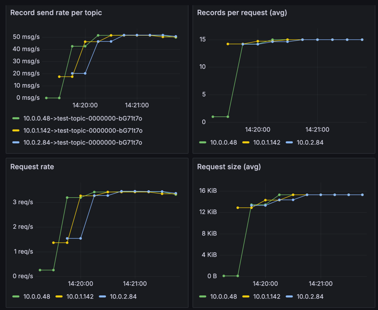
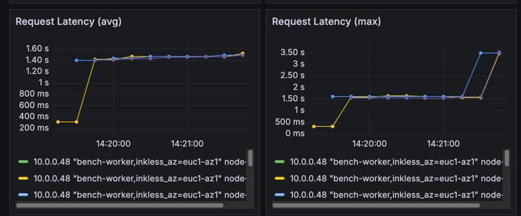
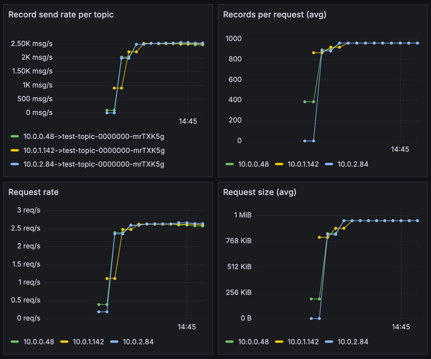
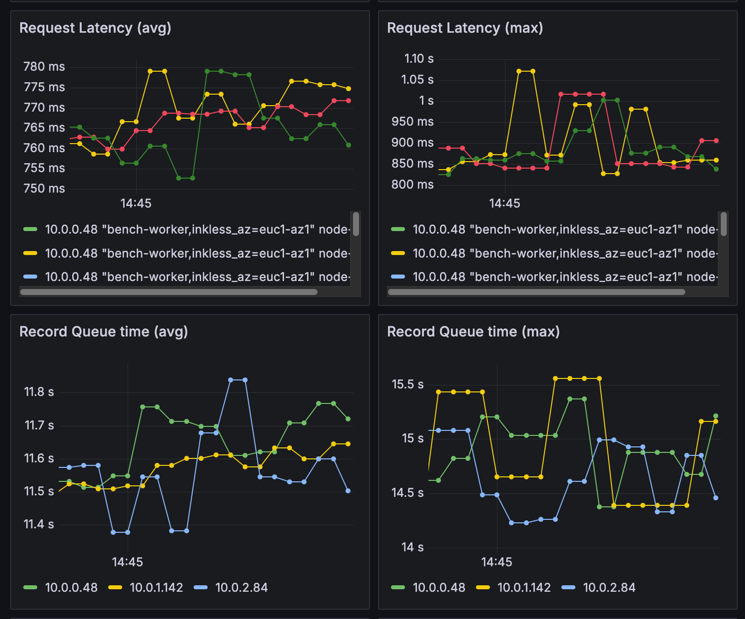
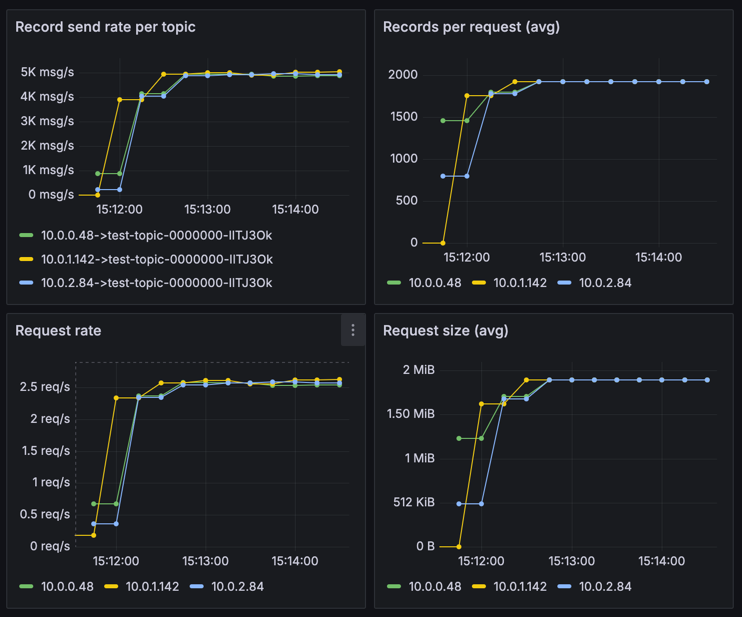
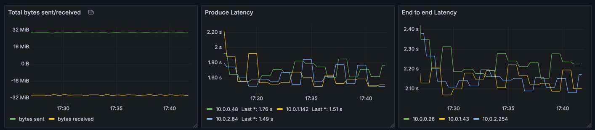
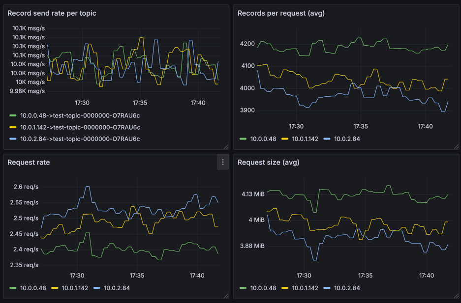
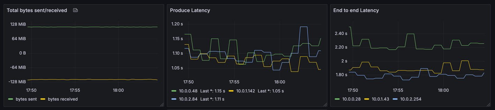

# Inkless Performance Tuning guide

## Write path

Before sending data to the Diskless topic, the producer will request topic metadata from the Kafka broker.
Given that Diskless topics are not replicated, and have no leaders, the metadata will return any broker in the cluster;
or find brokers within the same availability zone (AZ) if the client has included the AZ within the `client.id` property
following the pattern `client.id=...,diskless_az=<AZ>`. 

When writing to Diskless topics, the following stages are involved when a Produce request is received:

- Appending and Rotating the Write Ahead Log Segment
- Upload Files to Remote Storage
- Commiting Batches to Batch Coordinator
- Returning Produce Response

Rotating the WAL segment is bound by the `inkless.produce.commit.interval.ms` configuration (default 250ms),
and `inkless.produce.buffer.max.bytes` (default 8MiB).

Once a WAL segment is rotated, upload to remote storage is triggered.
e.g. for AWS S3 the upload latency depends on the segment size, with observed P99 latencies of 200-400ms for 2-8 MiB segments.

Committing batches to the Batch Coordinator depends on the batches per commit, and observed P99 latences for the PG implementation are around ~10-20ms.

For brokers to saturate the rotation and trigger faster uploads to increase throughput, concurrent producer requests are needed.
At the moment, this can only be achieved by using multiple producers and partitions, 
as the current implementation of the Kafka producer does not support concurrent requests from the same producer,
and a single request size is limited to the number of partitions: # partitions * max.message.size (1MiB default).

> [!IMPORTANT]
> When starting a single produce (e.g. kafka-producer-perf-test.sh) client, the producer will only send a single request at a time.
> Without any tuning, the producer will be able to create up to 1MiB request (default `max.request.size`) per request.
> and it will depend on how many partitions are available to the producer to get to that size
> based on the batch.size: batch.size * partitions = request size.
> 
> Considering the latencies of the Inkless pipeline, the throuhgput will be bound to 4 request per second
> as the WAL buffer is not saturated and will rotate every 250ms (default `inkless.produce.commit.interval.ms`).

To cope with this at the producer side, batching has to be tuned to align with the Inkless pipeline latencies.

The following configuration is recommended for the producer:

```properties
linger.ms=100  # or higher depending on the concurrency of the producers
batch.size=1000000
max.request.size=8000000
```

In this case, with 8 partitions to write to, the producer will be able to send up to 8MiB per request.

> [!NOTE]
> At the moment the Inkless implementation is sending all batches from the same request on the same WAL multi segment file.
> This means that if the request is larger than the `inkless.produce.buffer.max.bytes` (default 8MiB),
> then the upload latencies will be higher as the files are larger.
> This has a penalty on the throughput, as the upload will take longer to complete, slowing down commits.
> We have plans to improve this in the future by splitting the request into multiple WAL segments,
> but this is not yet implemented.

Having low concurrency (e.g. 1 producer per AZ) could lead to higher latencies, 
as the producer will wait for the linger.ms time before sending the request;
and a single request per producer will be processed by the broker at a time.

With default settings, a single producer, writing to a single partition will have a very low throughput and high latencies, 
as it will only be able to send a single request at a time:

```yaml
topics: 1
partitionsPerTopic: 1

# 10MiB per producer
producerRate: 30000
messageSize: 1024
producersPerTopic: 3

subscriptionsPerTopic: 1
consumerPerSubscription: 12
```

The producer will be bound to a maximum request size of 1 batch (16KiB by default) per request, 
with a request rate of 4 requests per second in average:



And the latencies will pile up trying to achieve the requested throughput of 10MiB:



> [!NOTE]
> These graphs show 3 producers (one per AZ) writing to a cluster of 3 brokers (one per AZ as well),
> which effectively means a single producer per broker.

So, unless your throughput is _very_ low, you will need to increase the number of partitions, 
and producer concurrency to achieve the desired throughput and latencies.

> [!IMPORTANT]
> If this is the case, very small files will be created in the remote storage,
> leading to a larger number of request to consume; increasing the overall cost (in some cases even higher than local storage).
> So, if this is your use-case, stick with local storage.
> Only when throughput per broker can be maintained > 1MiB/s,
> the Inkless implementation will be able to provide a better cost per request than local storage.

### Increasing number of partitions

For instance, let's increase the number of partitions to 64.
This should allow the produce to increase the request size to the maximum of 1MiB (default `max.request.size`):



This will increase the throughput to ~2-3 MiB/s per producer, as the request size is larger.



But the latencies are still high: the request latency is ~1sec, but the waiting time is ~16sec. Not good.
This is caused by the producer being too eager to produce (i.e. no linger time).

So, we could increase the batching to get to larger and more stable throughput.

### Tuning the producer batching

To achieve the initial goal of 10MiB/s, and a default request size of 1MiB is giving us ~2-3MiB/s per producer,
we would need to increase the linger time, to avoid piling up requests and waiting for the next request to be processed,
and increase the request size, to allow for producers to create larger requests.

Let's double the request size to 2MiB, double the batch size, and increase the linger time to 100ms:

```properties
  linger.ms=100
  batch.size=32000
  max.request.size=2000000
```

This will increase the throughput to ~5 MiB/s per producer, and the request size to 2MiB.



A producer can be pushed to higher throughput by increasing the batch size to its maximum (1MiB),
and increasing the request size to 8MiB, which will allow the producer to create larger requests:

```properties
  linger.ms=100
  batch.size=1000000
  max.request.size=8000000
```

The 30MiB/s goal can then be achieved with 3 producers per AZ, but the max request size is not saturated yet:





### Increasing produce concurrency

A single produce can do so much, so we need to increase the number of producers to achieve higher throughput.

For instance, to achieve 120MiB/s, we can increase the number of producers to 4 per AZ:



Even with lower produce latency as there are more producers writing to the same broker, rotating files faster, and uploading more data concurrently.

> [!NOTE]
> It is still early days for the Inkless implementation, and the performance numbers are only examples of how the tuning parameters and concurrency affect latency. 
> Improvements are under active research and development.

## Read path

When reading from Diskless topics, the following stages are involved when a Fetch request is received:

- Find the batches coordinates
- Plan the fetching strategy
- Fetch object ranges from remote storage
- Prepare Fetch response assigning offsets to the batches

During the initial find and planning stages, the broker will fetch the batch coordinates from the Batch Coordinator.
The observed P99 latencies for this stage are around ~10ms.
Fetching the objects from remote storage depends on the object size and the number of objects to fetch.
For instance, for AWS S3, the latencies are around 100-200ms for 2-8 MiB objects.

### Caching and Consumer Performance

Consumer fetch performance is heavily influenced by caching. Inkless implements a **local in-memory cache (Caffeine) per broker**, combined with **deterministic partition-to-broker assignment**:

- **Cache Hits**: When data is already cached (from recent producer writes or previous consumer reads), fetch latencies are significantly lower - typically in the range of 10-50ms depending on the broker's local processing
- **Cache Misses**: When data must be fetched from object storage, latencies include the object storage GET operation (~100-200ms for S3)
- **Cache Configuration**: The cache is configurable via:
  - `inkless.consume.cache.max.count` (default: 1000 objects)
  - `inkless.consume.cache.expiration.lifespan.sec` (default: 60 seconds)
  - `inkless.consume.cache.block.bytes` (default: 16 MiB)

#### AZ-Awareness and Cache Efficiency

Inkless achieves per-AZ cache locality through **deterministic partition assignment** and **AZ-aware metadata routing**, not a distributed cache. Each broker maintains its own independent local cache (Caffeine), and the system ensures clients in the same AZ consistently connect to the same broker for a given partition.

| Property         | How It Works                                                                      |
|------------------|-----------------------------------------------------------------------------------|
| Cache per broker | Each broker has an independent local Caffeine cache                               |
| AZ locality      | Metadata routing directs clients to brokers in their AZ                           |
| Partition affinity | Deterministic hash ensures same partition maps to same broker within an AZ      |
| Result           | Clients in the same AZ hit the same broker's cache for a given partition          |

**Optimal scenario**: When all clients (producers and consumers) are configured with the same `diskless_az` value matching their broker's `broker.rack`:
- Producers write to a deterministically-assigned broker in their AZ, populating that broker's local cache
- Consumers read from the same broker (same partition maps to same broker), benefiting from cache hits
- With sufficient cache capacity, **all recent data can be served from memory**
- Object storage GET requests are minimized, significantly reducing costs

**Multi-AZ scenario**: When clients are distributed across AZs:
- Each AZ has its own set of brokers, each with independent local caches
- A consumer in AZ-A reading data produced in AZ-B will incur a cache miss (different broker)
- Cross-AZ data transfer costs apply in addition to object storage costs

**Recommendations for cost optimization**:
1. Configure all clients with appropriate `diskless_az` in their `client.id`
2. Size the cache (`inkless.consume.cache.max.count`) to hold your hot working set
3. Adjust cache TTL (`inkless.consume.cache.expiration.lifespan.sec`) based on your consumer lag patterns
4. Monitor cache hit rates to validate your configuration

See [CLIENT-BROKER-AZ-ALIGNMENT.md](CLIENT-BROKER-AZ-ALIGNMENT.md) for detailed AZ configuration guidance and an explanation of how deterministic assignment achieves distributed-cache-like properties.

### Hot Path vs Cold Path (Lagging Consumers)

Inkless implements a two-tier fetch architecture that separates recent data requests from lagging consumer requests:

**Hot Path** (recent data):
- Uses the object cache for fast repeated access
- Dedicated executor pool (`inkless.fetch.data.thread.pool.size`, default: 32 threads)
- Low latency, typically served from cache
- No rate limiting

**Cold Path** (lagging consumers):
- For consumers reading data older than the threshold (`inkless.fetch.lagging.consumer.threshold.ms`)
- Bypasses cache to avoid evicting hot data
- Dedicated bounded executor pool (`inkless.fetch.lagging.consumer.thread.pool.size`, default: 16 threads)
- Optional rate limiting (`inkless.fetch.lagging.consumer.request.rate.limit`, default: 200 req/s)
- Separate storage client for resource isolation

**Path selection** is based on data age (batch timestamp), not consumer lag:
- Data newer than threshold → hot path (with cache)
- Data older than threshold → cold path (bypasses cache)
- Default threshold (`-1`) uses cache TTL, ensuring data stays "recent" while potentially in cache

> **Note:** The terms "trailing consumer" and "lagging consumer" are used interchangeably in Kafka literature. Inkless uses "lagging consumer" in configuration names.

### Consumer Rack Awareness

Similar to producers, consumers should configure rack awareness to minimize cross-AZ data transfer costs:

```properties
client.id=<custom_id>,diskless_az=<rack>
```

Where `<rack>` matches the `broker.rack` configuration. This ensures:
- Consumers fetch from deterministically-assigned brokers in the same availability zone
- Cache hits are served from the broker's local cache (same broker handles same partition)
- Cross-AZ data transfer costs are minimized as latest records are served from memory; no remote storage GET issued.
- If all clients are on the same AZ, then remote storage data transfer can be effectively zero. Otherwise, reads on other AZ represent at least 1 GET per AZ to cache an object.

### Optimizing Consumer Performance

1. **Increase consumer concurrency**: Multiple consumers reading from different partitions can parallelize fetches
2. **Align consumer rack with data**: Configure `client.id` with the appropriate `diskless_az` to stay within the same rack/AZ
3. **Understand cold path behavior**: Lagging consumers bypass the cache to avoid evicting hot data; consider rate limiting and thread pool sizing
4. **Monitor cache metrics**: Track cache hit rates to understand performance characteristics
5. **File merging**: The background file merger consolidates small objects, improving read performance for lagging consumers over time

### Read Amplification

Unlike traditional Kafka where each partition's data is stored contiguously, Inkless stores data from multiple partitions in the same object. This can lead to read amplification when:
- Reading from a single partition requires fetching objects containing data from multiple partitions
- The `inkless.consume.cache.block.bytes` setting controls the granularity of fetches (default 16 MiB blocks)

File merging helps reduce this over time by reorganizing data for better partition locality in merged objects.

### Tuning the Read Path

#### Broker Configuration

The read path can be tuned using three key broker configurations under the `inkless.` prefix:

| Configuration | Default | Description |
|---------------|---------|-------------|
| `fetch.lagging.consumer.thread.pool.size` | 16 | Thread pool size for lagging consumers. Set to **0** to disable the feature entirely. |
| `fetch.lagging.consumer.threshold.ms` | -1 (auto) | Time threshold (ms) to distinguish recent vs lagging data. `-1` uses cache TTL automatically. Must be ≥ cache lifespan when set explicitly. |
| `fetch.lagging.consumer.request.rate.limit` | 200 | Maximum requests/second for lagging consumers. Set to **0** to disable rate limiting. |

**Tuning guidance:**

- **Thread pool size**: Default of 16 threads (half of hot path's 32) is suitable for most workloads. Increase for higher lagging consumer concurrency, but be mindful of storage backend capacity.
- **Threshold**: The `-1` default aligns with cache lifecycle. Set an explicit value (e.g., `120000` for 2 minutes) if you need different lagging consumer classification.
- **Rate limit**: Default 200 req/s balances throughput with cost control. Adjust based on your object storage budget and capacity requirements.

#### Consumer Configuration

Inkless consumers should be configured for **throughput** rather than low latency. This applies to all consumers, not just those catching up from behind - a consumer starting from the beginning will eventually reach the hot path and continue with the same configuration.

```properties
fetch.max.bytes=67108864        # 64 MiB - maximum data per fetch request
max.partition.fetch.bytes=8388608  # 8 MiB - maximum data per partition
fetch.min.bytes=8388608         # 8 MiB - wait for substantial data
fetch.max.wait.ms=5000          # 5 seconds - allow time to accumulate data
```

**Why throughput-oriented configuration?**

Unlike traditional Kafka where data is read from local disk, Inkless reads involve:
- Object storage requests (when cache misses occur)
- Per-request costs regardless of data size
- Higher baseline latency (~100-200ms for object storage vs ~1-10ms for local disk)

Large batch fetches amortize these costs and latencies across more data. Whether reading from the hot path (cache) or cold path (object storage), larger batches are more efficient.

> **Note:** The hot/cold path distinction affects where data comes from, not how consumers should be configured. A consumer catching up will transition from cold path to hot path as it reaches recent data, but the same throughput-oriented configuration works well for both scenarios.

#### Monitoring the Read Path

Four metrics track hot/cold path behavior:

| Metric | Type | Description |
|--------|------|-------------|
| `RecentDataRequestRate` | Meter | Hot path request rate (recent data) |
| `LaggingConsumerRequestRate` | Meter | Cold path request rate (all lagging requests) |
| `LaggingConsumerRejectedRate` | Meter | Rejection events (queue full or executor shutdown) |
| `LaggingRateLimitWaitTime` | Histogram | Rate limit wait times |

**What to watch:**

- **High `LaggingConsumerRejectedRate`**: Consider increasing thread pool size or rate limit
- **High `LaggingRateLimitWaitTime`**: Indicates rate limiting is actively throttling requests (expected behavior under load)
- **Ratio of recent vs lagging requests**: Helps understand workload patterns and tune thresholds

#### Why Hot/Cold Separation Matters

**Before hot/cold separation**, when lagging consumers were active (e.g., during backfills):

- Unpredictable, severe performance spikes (producer latencies could spike to 40+ seconds)
- Complete producer blocking due to resource contention
- All consumers affected by resource contention
- Cache pollution: lagging consumer data evicting recent data

**After hot/cold separation**:

- Stable, predictable performance with controlled degradation
- Producers and tail-consumers (those reading recent data) maintain consistent performance
- Backfill jobs run at a stable, controlled rate
- Resource isolation prevents cascading failures

> **Key insight**: End-to-end latency may not improve in absolute terms, but **severe degradation and instability are removed entirely**. The system becomes predictable and controllable.
