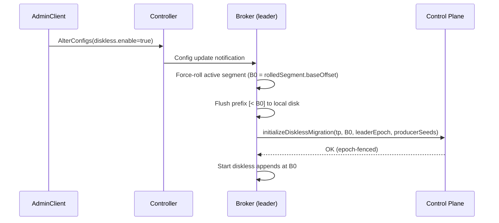
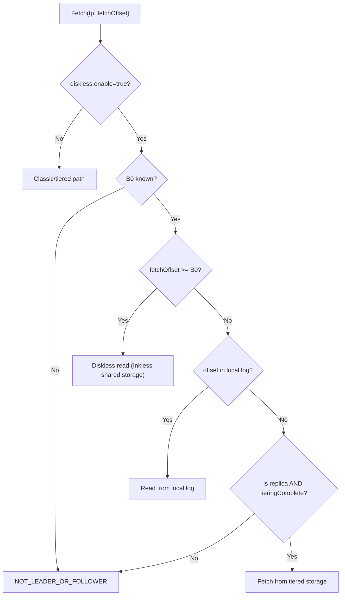
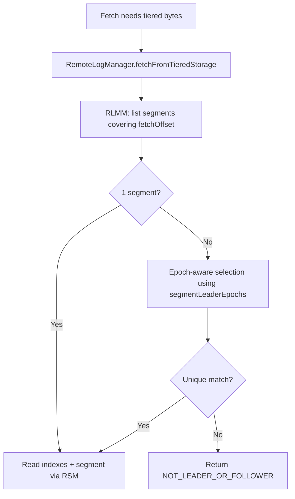
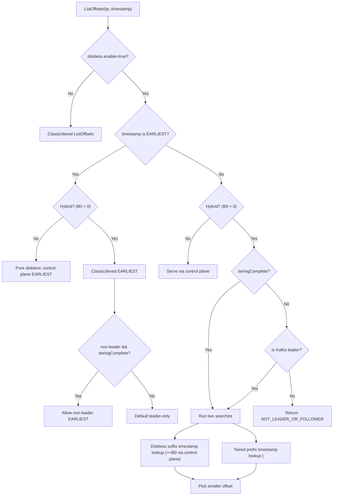

# Tiered → Diskless Migration (Design)

This doc describes a **forward-only, no-rewrite** migration from **classic+tiered** Kafka topics to **diskless** (Inkless) topics.

The design defines a **two-region logical log** per partition:

- **Tiered prefix**: offsets **`< B0`** are served from Kafka Tiered Storage (RLMM/RSM) using **canonical Kafka tiered semantics**.
- **Diskless suffix**: offsets **`>= B0`** are served from Inkless shared storage (object store) with ordering/indexing via the control plane.

Where:

- **`B0`** = `disklessLogStartOffset` (the partition boundary)
- **`tieringComplete`** = a readiness condition meaning the tiered prefix is remotely readable (so **any replica** may serve `< B0` reads, not just the leader).

---

## Goals

- **No-rewrite migration**: historical data stays in tiered storage; new data becomes diskless at a boundary.
- **Correctness-first reads**:
- `< B0` reads use Kafka's tiered read machinery (RemoteLogManager + RLMM/RSM).
- **Replica-served tiered reads**: After `tieringComplete`, **any replica** (not just the leader) may serve `< B0` reads from tiered storage. This is **not** standard Kafka behavior and is gated by explicit readiness checks to preserve correctness.
- **Kafka protocol compatibility**: no custom client protocol; use standard API behavior and standard error codes.
- **Operational trigger via Admin API**: migration is triggered by setting `diskless.enable=true`.
- **Performance isolation**: classic topics do not pay diskless/control-plane costs.
- **Upstreamable control-plane boundary**: Postgres is an implementation detail; the design supports swapping to a log-backed coordinator later.
- **Non-transactional diskless data**: Diskless suffix (`>= B0`) supports only non-transactional produce. All transactions must complete before migration. Idempotent continuity across `B0` is supported for non-transactional producers by seeding producer state.

---

## Non-goals

- **Transactions for diskless data**: Diskless topics (`>= B0` after migration) **DO NOT SUPPORT transactions**. All ongoing transactions in the classic log MUST complete (commit or abort) before migration. After migration, only non-transactional produce is supported for the diskless suffix.
- **Migrate-back** (diskless → local/tiered).
- **Diskless compaction**.

---

## Glossary

- **Tiered Storage**: Kafka remote log feature using **RLMM** (metadata) + **RSM** (segment bytes).
- **RLMM**: Remote Log Metadata Manager.
- **RSM**: Remote Storage Manager.
- **Diskless**: Inkless object storage for records + a control plane for ordering/indexing.
- **Control Plane**: Postgres-backed metadata backend (future: TopicBasedBatchCoordinator).
- **Tiered storage fetch**: Kafka tiered read from remote storage implemented via `RemoteLogManager.fetchFromTieredStorage(...)` (and `asyncFetchOffsetFromTieredStorage(...)` for ListOffsets-style lookups).

---

## State model

Per partition:

- **`diskless.enable`** (topic config)
    - `false` → classic/tiered behavior
    - `true` → diskless behavior (including migrated topics)
- **`B0` (`disklessLogStartOffset`)**
    - sentinel/undefined value represents “not set”
    - once set, it is **immutable within the same leader epoch** (a higher epoch may overwrite **only if the boundary is unset/reset**)
    - defines the split: `< B0` tiered prefix, `>= B0` diskless suffix
    - **Implementation note**: brokers cache `B0` lookups from the control plane (TTL ~1s) to keep Fetch/ListOffsets hot paths from hammering the control plane; on transient control plane failures they continue using the last cached value.
- **`tieringComplete`**
  - **sticky-true** once observed on a broker, but may be cleared if the prefix becomes unreadable (e.g., retention advances the earliest remote offset beyond `logStartOffset`)
    - indicates the tiered prefix `< B0` is fully uploaded to remote storage and readable via tiered storage by any replica

### Invariants

- **I1 — Routing isolation**: classic topics never consult the diskless control plane.
- **I2 — Boundary immutability**: `B0` is immutable within the same leader epoch; a higher epoch may overwrite **only if the boundary is unset/reset**.
- **I3 — Readiness gating**: non-leader replicas serve `< B0` reads from tiered storage only after `tieringComplete`.
- **I4 — Diskless replication semantics**: diskless suffix bytes are not replicated via follower fetch.

---

## Trigger: enabling diskless via Admin API

Migration is triggered by setting topic config:

- `diskless.enable=true`

At trigger time, the leader **starts** the migration workflow. `B0` is selected and persisted once prerequisites are satisfied.

### Implementation checklist

1. **Remove config validation restrictions** (`storage/src/main/java/org/apache/kafka/storage/internals/log/LogConfig.java`):
    - Remove checks that prevent changing `diskless.enable` from `false` to `true`
    - Allow dynamic topic config change for migration

2. **Control plane boundary initialization**:
   - Persist `B0` for each partition (migration: `B0 = current LEO`; diskless-from-start: `B0 = 0`)
   - Seed diskless producer state for idempotent continuity (see "Control plane initialization requirements")
   - Persist leader epoch at B0 (fencing; higher-epoch overwrite only if `B0` is unset/reset)

3. **Request routing** (see "Request handling during migration transition" section below):
    - Cache `disklessLogStartOffset` (B0) on each broker
    - Dispatch fetch requests based on `fetchOffset < B0` vs `>= B0`
    - Return appropriate errors when B0 not yet initialized

### Prerequisites and validation

Before initializing migration, the leader validates:

1. **Tiered storage availability** (if `B0 > 0` will result): `RemoteLogManager` must be configured and operational. Migration fails with `KAFKA_STORAGE_ERROR` if tiered storage is missing or disabled.
2. **Transaction completion**: New transactions are rejected as soon as `diskless.enable=true` (AddPartitionsToTxn fails for diskless topics). All ongoing transactions must complete (commit or abort) before `B0` is selected. This prevents splitting transactions across the migration boundary and avoids blocking transaction completion.
3. **Committed prefix**: The leader must not have an uncommitted tail. Migration waits for a quiescent point where the partition is caught up (high watermark \(HW\) has reached log end offset \(LEO\)), then rolls at \(B0 = LEO\). Once transactions are drained, the leader **quiesces client appends** (returning `REQUEST_TIMED_OUT`) until `B0` is persisted. If appends keep the tail uncommitted, migration may be delayed indefinitely unless operators quiesce producers.
4. **Empty topics**: For an empty local log, the broker initializes `B0=0` in the control plane so diskless produce/ListOffsets can start at offset 0. No tiered storage is required.

### Trigger points

Migration is initiated by:

1. **Primary path**: `TopicConfigHandler#updateLogConfig` when `diskless.enable` changes from `false` to `true`
    - Leader receives config change notification
   - Initiates migration: validation → transaction wait → boundary selection → control plane persistence

2. **Fallback path**: `ReplicaManager#applyLocalLeadersDelta` if a new leader is elected while migration is pending
    - New leader queries control plane for existing B0
    - If B0 exists: completes migration (idempotent)
    - If B0 missing: initiates new migration

Operational note (read/write readiness):
- If the control plane has not published `B0` yet and the broker **hosts the local log** (migration pending), the leader continues classic appends **while transactions are in flight**.
  - Once transactions are drained, the leader **quiesces client appends** (returning `REQUEST_TIMED_OUT`) until `B0` is persisted.
  - During the **brief boundary persistence attempt**, the leader may return `REQUEST_TIMED_OUT` to pause appends and prevent publishing `B0` below the current LEO.
- If `B0` is unknown and the broker **does not** host the local log (or cannot resolve a topicId), the broker returns `NOT_LEADER_OR_FOLLOWER` to force a metadata refresh.
- If `B0` lookup fails due to a transient control-plane error, the broker returns `REQUEST_TIMED_OUT`; hard control-plane failures map to `KAFKA_STORAGE_ERROR`.
- Diskless topics created directly have `B0=0` initialized by the **first leader** when the log is created; the controller only propagates config.
- **Triggering is asynchronous**: `AlterConfigs` returns after config propagation, not after migration completes. Clients may see retriable errors while migration is still pending.

### Diagram: Admin-trigger + boundary persistence



---

## Choosing and persisting the boundary (`B0`)

### Boundary selection

- `B0` is chosen as the partition **log end offset** at the moment migration prerequisites are satisfied, by **force-rolling** the active segment and taking `B0 = rolledSegment.baseOffset`.
- **Transaction handling**: Migration waits for all ongoing transactions to complete before selecting `B0`.
- The leader **flushes the prefix** `[< B0]` before persisting `B0` to the control plane (durability).
    - This flush is a **hard fsync** for segment bytes and indexes: Kafka segment flush ultimately calls `FileChannel.force(true)` (via `FileRecords.flush()`), and also flushes the log directory for crash-consistent segment creation.
- The broker **atomically seeds producer state and persists `B0`** so the suffix never becomes visible without idempotent continuity metadata.
- Control-plane persistence is **leader-epoch fenced**: a stale leader epoch cannot overwrite `B0`. A **higher** epoch may overwrite **only if `B0` is unset/reset** (to avoid orphaning diskless suffix data).
- Records produced **after `B0` is persisted** are assigned offsets starting at `B0` and are written to diskless storage.
    - `B0==0` is valid for **pure diskless** topics (no tiered prefix). If any replica has a non-empty local log in that case, it is treated as **divergent** and removed by the zombie cleanup truncation below.

### Follower synchronization

After the leader persists `B0` to the control plane:

1. **Discovery**: Followers learn about migration by:
    - Receiving updated topic config (`diskless.enable=true`) via metadata propagation
    - Querying the control plane for `B0` (via `refreshDisklessLogStartOffsetFromControlPlane`)

2. **Local reconciliation**: Each follower performs zombie cleanup (see below)

3. **Replication continues**: Followers replicate the tiered prefix (`< B0`) via standard Kafka replication until their `LEO >= B0`

### Local Log Reconciliation (Zombie Cleanup)

It is possible (though rare) for a former leader to have written to its **local log** after `B0` was established elsewhere (split-brain / zombie leader).
To prevent serving divergent history that conflicts with the authoritative Inkless suffix:

- **Trigger**: on startup, leadership transitions, or `diskless.enable=true` config update, if a broker sees **`diskless.enable=true`** and a **valid `B0`** from the control plane.
- **Actions**:
    - If `LocalLog.LEO > B0`: the broker **immediately truncates** its local log to `B0` (removing only the divergent tail `>= B0`).
    - If `LocalLog.LEO < B0` during leadership election: the broker **throws `CannotBecomeLeaderDueToLogGapException`**, aborting the leadership transition. This prevents a log gap where the leader would be unable to serve offsets in `[LEO, B0)`. The broker remains a follower and continues replication until `LEO >= B0`. This ensures data consistency and prevents serving incomplete history.
  - If `B0 < LocalLog.logStartOffset` (boundary points to already-truncated data): the broker **resets the boundary** to `UNDEFINED` (−1) and **attempts to clear it in the control plane** (best‑effort). Re‑migration must be triggered manually.

This ensures replicas do not serve or become leaders with divergent or incomplete history relative to the authoritative control-plane suffix.

### Control plane initialization requirements

Migration persists `B0` and **seeds diskless producer state** for idempotent continuity across the boundary.

Rationale:
1. Migration waits for **no ongoing transactions** and for **LSO = LEO**, so there is no in-flight transactional state to preserve.
2. The tiered prefix remains readable through **Kafka remote log metadata + indexes**; no control-plane side metadata is needed to serve it.
3. The diskless suffix (`>= B0`) does **not** support transactions, but **does** support idempotent continuity by seeding producer state from the classic prefix.

**Write ordering**: Seed producer state **before** persisting `B0` so brokers never accept diskless appends without the required idempotent state.
While `B0` is unset (`-1`), repeated seeding may **overwrite** prior seeds for retry safety; once `B0` is set, seeding must be **idempotent** and mismatches are rejected.

### Persistence + immutability

- `B0` is persisted in the control plane and is **immutable within the same leader epoch**.
- Setting the same `B0` again in the same epoch is idempotent; attempting to change to a different value is rejected **unless a higher leader epoch overwrites it while `B0` is unset/reset**.
- `B0` is only reset to `UNDEFINED` in exceptional cases where the boundary becomes invalid (e.g., `B0 < logStartOffset` after log truncation). The broker attempts a best‑effort control‑plane reset; if it fails, re‑migration must wait until the control plane is fixed.

### Idempotency and failure recovery

Migration initialization is designed to be idempotent:

- If the leader crashes after persisting `B0` but before updating local state, the next leader will read `B0` from the control plane and complete initialization.
- If `B0` is already set in the control plane, the operation succeeds (idempotent write).
- If local state shows migration complete but the control plane has no `B0`, the leader re-initializes (control plane is the source of truth).
- If a new leader is elected while `diskless.enable=true` and `B0` is still undefined, the leader retries migration when it has a local log (migration pending case).

---

## Determining `tieringComplete`

`tieringComplete` is a per-broker cached condition derived from tiered storage state:

- It becomes true when tiered storage can serve the prefix **without gaps** up to (and including) `B0 - 1` (i.e. `COPY_SEGMENT_FINISHED` segments cover the range continuously starting from the earliest remotely available offset; overlaps are allowed).
- The earliest remotely available offset must be **at or below the partition logStartOffset**. If retention or remote deletion advances the earliest remote offset beyond logStartOffset, non-leader prefix reads must be disabled (treat `tieringComplete=false`).
- Once true (for a given `B0` on a broker), it is treated as **sticky** on that broker to avoid oscillation on transient RLMM/RSM failures.
  - If retention or truncation makes the prefix no longer fully available (e.g., earliest remote offset > logStartOffset), readiness must be cleared. This also disables **non-leader** `ListOffsets(EARLIEST)` responses because those depend on gap-free tiered prefix coverage.
  - If `B0` is reset, the cached readiness must be cleared.

This is used as the gate to allow **non-leader replicas** to serve tiered prefix reads from remote storage. **Replica membership requirement**: Only brokers that are members of the partition's replica set can serve reads. Serving from arbitrary brokers outside the replica set is explicitly not supported in this design.

### Retention and earliest offset in hybrid topics

Hybrid topics follow Kafka tiered storage retention semantics. `logStartOffset` reflects the earliest **readable** offset across local+remote. If remote retention advances the earliest remote offset such that the prefix is no longer gap‑free up to `B0 - 1`, `tieringComplete` must be cleared and **non‑leader** prefix reads (including `EARLIEST`) are disabled until the gap is resolved. The leader continues to answer `EARLIEST` using standard Kafka tiered storage behavior.

Diskless suffix retention is enforced by the control plane (RetentionEnforcer) using the topic’s `retention.ms`/`retention.bytes` settings:
- The control plane advances the **diskless log start offset** for the suffix; `B0` is **not** advanced by retention.
- The earliest diskless offset is `max(B0, disklessLogStartOffset)`. Reads/ListOffsets below that return **offset‑out‑of‑range**, just like normal retention.
- Deleting the entire diskless suffix advances the diskless log start offset to the diskless high watermark; the suffix remains empty until new appends arrive.

---

## Request handling during migration transition

### State machine during migration

Migration progresses through distinct states, each with specific request handling behavior:

#### 1. **Before config change**: `diskless.enable=false`
- **Produce**: Appends to classic local log (UnifiedLog)
- **Fetch**: Serves from classic/tiered path (UnifiedLog + RemoteLogManager)
- **B0**: Not set (`UNDEFINED`)

#### 2. **Config changed, migration pending**
- **Duration**: Milliseconds to seconds in the common case; longer if there are ongoing transactions.
- **New transactions**: Rejected (AddPartitionsToTxn fails for diskless topics).
- **Produce requests**: The leader continues using the classic/tiered path while transactions are in flight. Once transactions are drained, it returns `REQUEST_TIMED_OUT` to quiesce until `B0` is persisted. Brokers that do not host the local log return `NOT_LEADER_OR_FOLLOWER`.
- **Fetch requests**: The leader continues using the classic/tiered path until `B0` is persisted. Non-leader replicas without the local log return `NOT_LEADER_OR_FOLLOWER`.
- **Boundary safety**: `B0` is not reserved in advance. It is selected only when persisted, and is always set to the **then-current** `LEO`. If appends keep advancing `LEO`, migration simply waits for the next quiescent point; `B0` will never be lower than the local `LEO` at the time of persistence.
- **Crash safety**: If leader fails, a new leader retries migration after it is safe to do so.

#### 3. **B0 persisted, but not all brokers aware**
- **Leader** (knows B0):
    - Produce: Routes to diskless for new records (offset >= B0)
    - Fetch `< B0`: Classic/tiered path
    - Fetch `>= B0`: Diskless path
- **Followers** (haven't refreshed B0 yet):
    - Produce: Return `NOT_LEADER_OR_FOLLOWER` (force metadata refresh)
    - Fetch: Return `NOT_LEADER_OR_FOLLOWER` until B0 is refreshed from control plane
- **B0 propagation**: Followers refresh B0 from control plane via `refreshDisklessLogStartOffsetFromControlPlane()`

#### 4. **Steady state**: All replicas know B0
- Normal hybrid routing (see "Fetch routing" section below)

### Produce request handling by state

| State | Leader Behavior | Follower Behavior |
|-------|----------------|-------------------|
| Before migration | Append to UnifiedLog | Should not receive produce |
| Migration pending (B0 not set) | Append to UnifiedLog while transactions in flight; otherwise `REQUEST_TIMED_OUT` (quiescing) | `NOT_LEADER_OR_FOLLOWER` |
| After B0 set (local) | Route to diskless storage | `NOT_LEADER_OR_FOLLOWER` |
| After B0 set (replica doesn't know yet) | N/A | `NOT_LEADER_OR_FOLLOWER` (force refresh) |

**Error code when B0 not initialized**:
- `NOT_LEADER_OR_FOLLOWER` when `B0` is missing on a broker that does not host the local log (forces client to retry and refresh metadata).
- `REQUEST_TIMED_OUT` for transient control-plane lookup failures, or when the leader is quiescing client appends until `B0` is persisted.
- `KAFKA_STORAGE_ERROR` for hard control-plane failures.
Default `UNKNOWN_TOPIC_OR_PARTITION` should be mapped to `NOT_LEADER_OR_FOLLOWER` for diskless topics.

### Fetch request handling by state

| State | Replica Behavior |
|-------|------------------|
| Before migration | Classic/tiered path (UnifiedLog + RemoteLogManager) |
| During initialization (B0 not set locally) | Continue serving classic/tiered (B0 not visible yet) |
| After B0 set, fetchOffset < B0 | Classic/tiered path (tiered prefix) |
| After B0 set, fetchOffset >= B0 | Diskless path (Inkless shared storage) |
| After B0 set, but broker doesn't know B0 | `NOT_LEADER_OR_FOLLOWER` (force refresh) |

### Implementation: caching B0

Each broker caches `disklessLogStartOffset` (B0) for each partition:

- **Cache location**: `Partition.disklessLogStartOffset` (volatile field)
- **Cache refresh**:
    - On leadership transition: `Partition.refreshDisklessLogStartOffsetFromControlPlane(topicId)`
    - On fetch/produce: Check cached value, refresh if `UNDEFINED`
- **Cache invalidation**: On leadership transitions or explicit resets (B0 is immutable within a leader epoch)
- **TTL for control plane queries**: ~1s for UNDEFINED/unknown `B0` (and after boundary reset) to avoid hammering the control plane on hot paths. Once a valid `B0` is cached, it does not require periodic refresh.

**Dispatch logic** (pseudo-code):
```scala
if (diskless.enable) {
  val b0 = partition.disklessLogStartOffset  // cached
  if (b0 == UNDEFINED) {
    partition.refreshDisklessLogStartOffsetFromControlPlane(topicId)
    return NOT_LEADER_OR_FOLLOWER  // client will retry
  }
  
  if (fetchOffset < b0) {
    // Route to UnifiedLog (classic/tiered prefix)
    return readFromUnifiedLog(fetchOffset)
  } else {
    // Route to diskless storage (Inkless)
    return readFromDisklessLog(fetchOffset)
  }
}
```

---

## Fetch routing (client + non-leader replica serving)

Fetch routing is implemented in `ReplicaManager.fetchMessages`.

### Diagram: Fetch routing decision tree



**Note**: `tieringComplete` is a **non-leader** readiness gate. The Kafka leader may serve `< B0` reads from its local log even when `tieringComplete=false`.

### Error semantics (Fetch)

#### Fetch Response Boundary (Short Reads)

**Invariant:** a single Fetch response for a partition must **not** cross the `B0` boundary.

- If `fetchOffset < B0`, the request is served by the **classic/tiered prefix** path and returns records **only in** `[fetchOffset, B0)`.
    - If the client requested a large range that would otherwise span `B0` (e.g. `fetchOffset=B0-10, maxBytes=huge`), the broker returns a **short read** ending at the **EOF of the prefix** (effectively at `B0`).
    - This forces the client to issue the next Fetch starting at `B0`, which can then be cleanly routed to the **diskless suffix** path.
- The broker must not “helpfully” append diskless records (`>= B0`) to a prefix Fetch response, even if it could satisfy more bytes.

#### Error semantics table (migration-specific)

| Scenario | When it happens | Broker response (per partition) | Why |
|---|---|---|---|
| Diskless fetch hits broker without Inkless enabled | `diskless.enable=true` topic, but broker lacks Inkless shared state | `KAFKA_STORAGE_ERROR` | Avoids “empty forever”; signals hard misconfiguration |
| Follower fetch at `fetchOffset >= B0` (diskless suffix) | Follower continues fetching after migration boundary | `Errors.NONE` + empty records; `highWatermark/lastStableOffset <= B0` | Prevents ISR churn; diskless suffix is not replicated via Kafka |
| Non-leader replica `< B0` fetch before readiness | Client routed to a non-leader replica, requests offset `< B0` while `tieringComplete=false` | `NOT_LEADER_OR_FOLLOWER` | Forces metadata refresh; prevents serving incomplete tiered data |
| Tiered storage fetch is ambiguous | Multiple remote segments cover the offset and epoch-disambiguation yields no unique answer | `NOT_LEADER_OR_FOLLOWER` | Correctness-first: never guess bytes |


#### Diskless misconfiguration

Diskless topics require Inkless shared state (control plane + object store client) to be configured on the broker.

- If a diskless **Produce/Fetch/ListOffsets** request arrives on a broker that does not have Inkless enabled, the broker returns **`KAFKA_STORAGE_ERROR`** for the affected partitions (not an empty response).

- If a broker cannot safely serve `< B0` (because it is not a replica and `tieringComplete` is false), it returns **`NOT_LEADER_OR_FOLLOWER`**.
    - This forces a metadata refresh and prevents clients from repeatedly polling an endpoint that cannot serve the request.

---

## Tiered storage reads on non-leader replicas

### Why this exists

After `tieringComplete`, clients may be routed to non-leader replicas (for load balancing / AZ affinity) via metadata transformation. Those replicas must be able to serve `< B0` reads from tiered storage, even if the data is no longer in their local log.

This is **client read routing**, not follower replication. Follower fetch remains leader‑driven and follows standard Kafka replication behavior.

**Replica membership requirement**: Only brokers that are members of the partition's replica set can serve reads. Arbitrary brokers outside the replica set cannot serve data.

### Implementation strategy

- Use Kafka's tiered storage read machinery: `RemoteLogManager.fetchFromTieredStorage(...)`.
- This relies on the existing RemoteLogManager tiered read path; it is **extended** with epoch-aware disambiguation for overlapping segments so we never guess bytes.
- When the offset is not in the replica's local log (e.g., `localLogStartOffset` advanced to `B0` after migration), the remote segment selection is performed using **leader-epoch aware disambiguation**:
    - Determine the expected leader epoch for the fetch offset from RLMM-provided per-segment leader epoch ranges.
    - Select the unique remote segment matching `(offset range contains fetchOffset) AND (segment leader epoch == expected epoch)`.
  - If RLMM metadata is missing or no unique match exists, return `NOT_LEADER_OR_FOLLOWER` (correctness-first: never guess bytes).

### TopicId mapping requirement

Tiered storage is keyed by `TopicIdPartition`. Replicas must be able to obtain the topicId for a topic/partition and use it for remote lookups.

### Diagram: Tiered storage fetch path



---

## Follower fetch / replication semantics

Diskless topics do not rely on follower fetch replication for durability of `>= B0` bytes.

- Follower fetches for the **tiered prefix** (`< B0`) continue to work via the classic path (local log / tiered as needed).
- Follower fetches that would involve **diskless suffix** reads (`>= B0`) do not replicate bytes.
  - To keep ISR stable in RF>1 clusters, the Kafka leader responds to follower fetches in the diskless region with **`Errors.NONE` + empty records**, and caps `highWatermark/lastStableOffset` to **`min(current, B0)`** (never advancing beyond the boundary).
- Classic topics continue to use Kafka replication normally.

### Follower bootstrap for hybrid topics

For hybrid topics with a tiered prefix (`B0 > 0`), new replicas or replicas recovering from data loss must replicate the tiered prefix (`< B0`) via standard Kafka replication before joining ISR.

**Future optimization (KIP-1023)**: A follower bootstrap optimization could allow empty followers to start replication from `B0` instead of replicating the entire tiered prefix, since tiered data is already available in remote storage. This optimization is **not yet implemented** in the current version.

---

## ListOffsets semantics (hybrid behavior)

### Error semantics (ListOffsets)

- Control plane failures are mapped deterministically:
  - transient unavailability/timeouts → `REQUEST_TIMED_OUT`
  - fatal/unknown failures → `KAFKA_STORAGE_ERROR`
    - missing topic/partition identity → `UNKNOWN_TOPIC_OR_PARTITION`
- `EARLIEST` on **non-leader** replicas requires `tieringComplete` (gap-free tiered prefix coverage). If the earliest remote offset advances beyond `logStartOffset`, `tieringComplete` is cleared and non-leader `EARLIEST` returns `NOT_LEADER_OR_FOLLOWER` to force a leader retry.
- For hybrid timestamp queries, replicas perform a **dual-search** (tiered prefix + diskless suffix) and return the candidate with the **smallest offset**. The implementation enforces that the **suffix** candidate must be `>= B0` and the **prefix** candidate must be `< B0`; violations return `KAFKA_STORAGE_ERROR`. Non-leader replicas can serve these queries once `tieringComplete` is satisfied; otherwise they return `NOT_LEADER_OR_FOLLOWER` to force a retry to the leader.


All ListOffsets routing is implemented in `ReplicaManager.fetchOffset(...)`.

### Diskless region (control plane authoritative, but hybrid-correct)

For `diskless.enable=true` topics, the control plane is authoritative for the **diskless suffix** (`>= B0`).

- **LATEST**: served via control plane.
- **Timestamp-based queries** (anything except EARLIEST/LATEST):
    - If the partition is **pure diskless** (no tiered prefix), serve via control plane.
    - If the partition is **hybrid** (tiered prefix exists), ListOffsets must be correct across the **entire logical log**.

      For **hybrid** partitions, the broker must be correct even when record timestamps are not monotonic.

      It therefore does a **two-region search** and returns the answer with the **smallest offset** (earliest in the log):

        - Search tiered prefix (`< B0`) for the first offset whose record timestamp is `>= requestedTimestamp`:
            - before `tieringComplete`: the **Kafka leader** answers from **local log** (no "tiered gap")
            - after `tieringComplete`: any replica may answer via **tiered storage fetch** from remote storage
        - Search diskless suffix (`>= B0`) for the first offset whose record timestamp is `>= requestedTimestamp` (via control plane).
        - **Invariant**: the control plane ListOffsets implementation is **suffix-only** for hybrid partitions and must never return an offset `< B0`.
        - If both searches return a candidate, return the one with the **smaller offset**.
        - If only one returns a candidate, return it.
        - If neither returns a candidate, return empty.

This keeps timestamp ListOffsets Kafka-correct for migrated topics without requiring the control plane to index tiered history.

### EARLIEST behavior for hybrid topics

Hybrid topics still have `< B0` history.

- If the partition has pre-boundary history (hybrid), **EARLIEST** is served by the classic/tiered path so clients discover the true earliest offset.
- For pure diskless topics (B0=0), control plane can serve EARLIEST.

### EARLIEST on non-leader replicas (after tieringComplete)

Once `tieringComplete` is true, non-leader replicas may serve **EARLIEST** by returning the **earliest remotely available offset** for the tiered prefix (minimum `startOffset` among `COPY_SEGMENT_FINISHED` remote segments). If the earliest remote offset advances beyond `logStartOffset`, `tieringComplete` is cleared and non-leader EARLIEST is no longer served.

### Diagram: ListOffsets routing



---

## Metadata routing (“leader lying”) rules

### Error semantics (Metadata)

- If a broker cannot safely enable metadata rewriting for a diskless partition (e.g., boundary unknown or readiness not satisfied), it returns unmodified metadata for that partition.


### Scope (what this affects)

This migration design relies on metadata rewriting for **client routing** (primarily Fetch/ListOffsets) for legacy clients. Diskless **produce is accepted on any replica** with Inkless enabled and `B0` known, so metadata rewriting is safe for producers **once migration‑ready**. When `B0` is undefined (migration pending), metadata rewriting is disabled and produce remains leader‑only on the classic path.

**KIP-1163 alignment note**: KIP-1163 proposes **Metadata API v14** with explicit diskless fields (`IsDiskless`, `PreferredProduceBroker`, and request `RackId`), which would remove the need for "leader lying". KIP-1163's vision is for metadata to advertise multiple brokers that can serve a partition, **but those brokers are still replicas** in the replica set (not arbitrary non-replica brokers). Until KIP-1163 exists, we keep rewriting deliberately narrow and avoid rewriting controller-owned state.
Diskless write semantics are provided by Inkless, but migration requires that any replica selected by metadata rewriting has:

- Inkless enabled,
- `B0` known, and
- readiness satisfied for serving the tiered prefix when needed (`tieringComplete`).


Metadata responses may be transformed for diskless topics to route clients to an appropriate broker.

### Safety gating rules

A broker rewrites leadership metadata only when:

- The topic is `diskless.enable=true`.
- `B0` is known on the broker.
- The partition is “migration-ready” for any-replica routing (readiness is satisfied for tiered prefix serving).

### What the transformer rewrites

### Leader epoch contract

Metadata rewriting **preserves the partition’s real leader epoch** (from KRaft metadata). Leader-lying changes *who serves*, not the partition epoch identity.

- For diskless-suffix operations served from Inkless/control plane, the serving broker does not require a local log/epoch match.
- For tiered-prefix operations served via tiered storage fetches, the serving broker does not rely on local epoch fencing; on ambiguity or missing readiness it returns `NOT_LEADER_OR_FOLLOWER`.

When enabled for a partition:

- The transformer rewrites **only** `leader = chosenReplica`, selecting from the partition's **existing replica set**.
- It **does not** rewrite `replicas`, `isr`, offline replicas, ELR/LKELR, or error codes.
- Brokers outside the replica set are **never** advertised as leaders, ensuring only replicas serve reads.

### Leader selection policy

Selection chooses among **alive replicas** (AZ-aware) within the partition’s existing replica set. Readiness gating ensures the chosen replica can serve the required read APIs once enabled.

Practical stability rule:

- If the client AZ cannot be determined (or broker racks are not configured / don’t match), prefer keeping the **original Kafka leader** when it is alive. This reduces client churn and avoids routing to a broker that may not yet have observed tiered readiness in environments without racks.

---

## Control plane (Postgres) schema and functions

The control plane stores the authoritative partition boundary:

### Core tables and columns

- `diskless_log_start_offset` (partition boundary `B0`)
- `diskless_log_start_epoch` (leader epoch at which `B0` was persisted; fencing only)

### Schema migrations

- `V11__Add_diskless_log_start_offset.sql` - adds `B0` column
- `V12__Commit_file_respects_diskless_log_start_offset.sql` - commit jobs respect boundary
- `V13__List_offsets_respects_diskless_log_start_offset.sql` - ListOffsets logic respects boundary
- `V14__Add_diskless_log_start_epoch.sql` - adds leader-epoch fencing for `B0`

### Functions

- `initializeDisklessMigration(topicId, partition, boundary, leaderEpoch, entries)` - **atomically** seed producer state + persist `B0` (idempotent for identical inputs; higher epoch wins, stale epochs rejected)
- `setDisklessLogStartOffset(topicId, partition, boundary)` - reset `B0` (best‑effort) or idempotently persist when unset; it does **not** bypass epoch fencing
- `getDisklessLogStartOffset(topicId, partition)` - read `B0` (cached by brokers)
- `seedProducerState(topicId, partition, entries)` - seed producer state for idempotent continuity (overwritable while `B0` is unset)

---

## Testing strategy

### Core migration scenarios

- Migration trigger via Admin API is functional and idempotent
- No data loss across boundary: prefix and suffix both readable
- Fetch spanning boundary: consumer can read both regions
- ListOffsets behavior aligns with hybrid semantics

### Transaction handling (pre-migration only)

- **Critical**: New transactions are rejected as soon as `diskless.enable=true`; any in‑flight transactions must complete (commit or abort) before migration can select `B0`.
- **Quiescing**: Once transactions are drained, the leader rejects client produces (`REQUEST_TIMED_OUT`) until `B0` is persisted.
- **After migration**: Diskless suffix (`>= B0`) does NOT support transactional produce; idempotent continuity across the boundary is supported for non-transactional producers

### Failure and edge cases

- Leader failure during migration: new leader completes initialization from control plane
- Follower catches up after migration: zombie cleanup truncates divergent data
- Follower attempts leadership with `LEO < B0`: correctly throws `CannotBecomeLeaderDueToLogGapException`
- Tiered storage unavailable: migration correctly fails with `KAFKA_STORAGE_ERROR`
- Empty topic migration: correctly initializes with `B0=0`

### Infrastructure

- Tiered storage backend for migration tests uses MinIO/S3 via `S3RemoteStorageManager`
- Control plane state persistence and recovery is tested

---

## Future work

- **Transactions for diskless topics**: Adding transactional produce and `read_committed` isolation for diskless data (`>= B0`) is a future enhancement. Currently, diskless data does not support transactions.
- **Migrate-back** (diskless → local/tiered) and multi-boundary routing.
- **Diskless compaction** to tiered.
- Replace Postgres control plane with TopicBasedBatchCoordinator.
