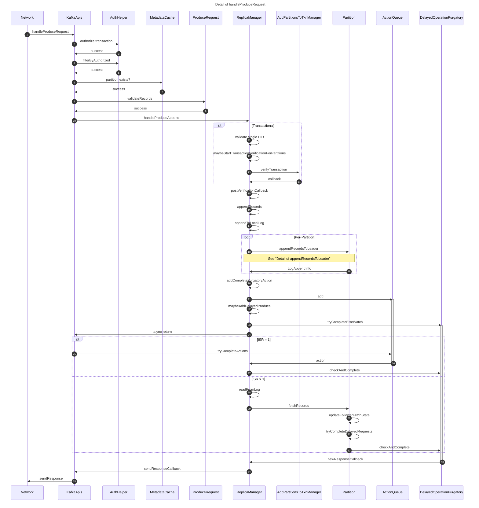
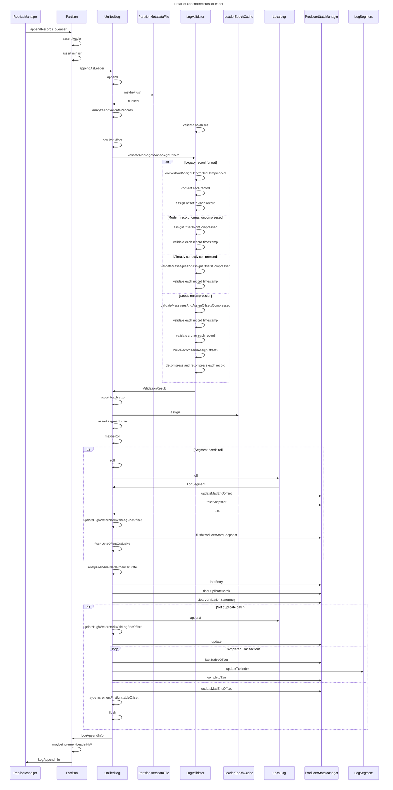

```mermaid
---
title: Detail of handleProduceRequest
---
sequenceDiagram
    autonumber
    Network->>KafkaApis: handleProduceRequest
    KafkaApis->>AuthHelper: authorize transaction
    AuthHelper->>KafkaApis: success
    KafkaApis->>AuthHelper: filterByAuthorized
    AuthHelper->>KafkaApis: success
    KafkaApis->>MetadataCache: partition exists?
    MetadataCache->>KafkaApis: success
    KafkaApis->>ProduceRequest: validateRecords
    ProduceRequest->>KafkaApis: success
    KafkaApis->>ReplicaManager: handleProduceAppend
    alt Transactional
        ReplicaManager->>ReplicaManager: validate single PID
        ReplicaManager->>ReplicaManager: maybeStartTransactionVerificationForPartitions
        ReplicaManager->>AddPartitionsToTxnManager: verifyTransaction
        AddPartitionsToTxnManager->>ReplicaManager: callback
    end
    ReplicaManager->>ReplicaManager: postVerificationCallback
    ReplicaManager->>ReplicaManager: appendRecords
    ReplicaManager->>ReplicaManager: appendToLocalLog
    loop Per-Partition
        ReplicaManager->>Partition: appendRecordsToLeader
        note over ReplicaManager,Partition: See "Detail of appendRecordsToLeader"
        Partition->>ReplicaManager: LogAppendInfo
    end
    ReplicaManager->>ReplicaManager: addCompletePurgatoryAction
    ReplicaManager->>ActionQueue: add
    activate ActionQueue
    ReplicaManager->>ReplicaManager: maybeAddDelayedProduce
    ReplicaManager->>DelayedOperationPurgatory: tryCompleteElseWatch
    activate DelayedOperationPurgatory
    ReplicaManager->>KafkaApis: async return
    alt ISR = 1
        KafkaApis->>ActionQueue: tryCompleteActions
        ActionQueue->>ReplicaManager: action
        deactivate ActionQueue
        ReplicaManager->>DelayedOperationPurgatory: checkAndComplete
    else ISR > 1
        ReplicaManager->>ReplicaManager: readFromLog
        ReplicaManager->>Partition: fetchRecords
        Partition->>Partition: updateFollowerFetchState
        Partition->>Partition: tryCompleteDelayedRequests
        Partition->>DelayedOperationPurgatory: checkAndComplete
    end
    DelayedOperationPurgatory->>ReplicaManager: newResponseCallback
    deactivate DelayedOperationPurgatory
    ReplicaManager->>KafkaApis: sendResponseCallback
    KafkaApis->>Network: sendResponse
```

```mermaid
---
title: Detail of appendRecordsToLeader
---
sequenceDiagram
    ReplicaManager->>Partition: appendRecordsToLeader
    Partition->>Partition: assert leader
    Partition->>Partition: assert min isr
    Partition->>UnifiedLog: appendAsLeader
    UnifiedLog->>UnifiedLog: append
    UnifiedLog->>PartitionMetadataFile: maybeFlush
    PartitionMetadataFile->>UnifiedLog: flushed
    UnifiedLog->>UnifiedLog: analyzeAndValidateRecords
    LogValidator->>LogValidator: validate batch crc
    UnifiedLog->>UnifiedLog: setFirstOffset
    UnifiedLog->>LogValidator: validateMessagesAndAssignOffsets
    alt Legacy record format
        LogValidator->>LogValidator: convertAndAssignOffsetsNonCompressed
        LogValidator->>LogValidator: convert each record
        LogValidator->>LogValidator: assign offset to each record
    else Modern record format, uncompressed
        LogValidator->>LogValidator: assignOffsetsNonCompressed
        LogValidator->>LogValidator: validate each record timestamp
    else Already correctly compressed
        LogValidator->>LogValidator: validateMessagesAndAssignOffsetsCompressed
        LogValidator->>LogValidator: validate each record timestamp
    else Needs recompression
        LogValidator->>LogValidator: validateMessagesAndAssignOffsetsCompressed
        LogValidator->>LogValidator: validate each record timestamp
        LogValidator->>LogValidator: validate crc for each record
        LogValidator->>LogValidator: buildRecordsAndAssignOffsets
        LogValidator->>LogValidator: decompress and recompress each record
    end
    LogValidator->>UnifiedLog: ValidationResult
    UnifiedLog->>UnifiedLog: assert batch size
    UnifiedLog->>LeaderEpochCache: assign
    UnifiedLog->>UnifiedLog: assert segment size
    UnifiedLog->>UnifiedLog: maybeRoll
    alt Segment needs roll
        UnifiedLog->>UnifiedLog: roll
        UnifiedLog->>LocalLog: roll
        LocalLog->>UnifiedLog: LogSegment
        UnifiedLog->>ProducerStateManager: updateMapEndOffset
        UnifiedLog->>ProducerStateManager: takeSnapshot
        ProducerStateManager->>UnifiedLog: File
        UnifiedLog->>UnifiedLog: updateHighWatermarkWithLogEndOffset
        UnifiedLog->>ProducerStateManager: flushProducerStateSnapshot
        UnifiedLog->>UnifiedLog: flushUptoOffsetExclusive
    end
    UnifiedLog->>UnifiedLog: analyzeAndValidateProducerState
    UnifiedLog->>ProducerStateManager: lastEntry
    UnifiedLog->>ProducerStateManager: findDuplicateBatch
    UnifiedLog->>ProducerStateManager: clearVerificationStateEntry
    alt Not duplicate batch
        UnifiedLog->>LocalLog: append
        UnifiedLog->>UnifiedLog: updateHighWatermarkWithLogEndOffset
        UnifiedLog->>ProducerStateManager: update
        loop Completed Transactions
            UnifiedLog->>ProducerStateManager: lastStableOffset
            UnifiedLog->>LogSegment: updateTxnIndex
            UnifiedLog->>ProducerStateManager: completeTxn
        end
        UnifiedLog->>ProducerStateManager: updateMapEndOffset
        UnifiedLog->>UnifiedLog: maybeIncrementFirstUnstableOffset
        UnifiedLog->>UnifiedLog: flush
    end
    UnifiedLog->>Partition: LogAppendInfo
    Partition->>Partition: maybeIncrementLeaderHW
    Partition->>ReplicaManager: LogAppendInfo
```
Note: Other operations which call DelayedOperationPurgatory::checkAndComplete are omitted for clarity.
These include: changes to the ISR, changes to leadership, partition deletion.
