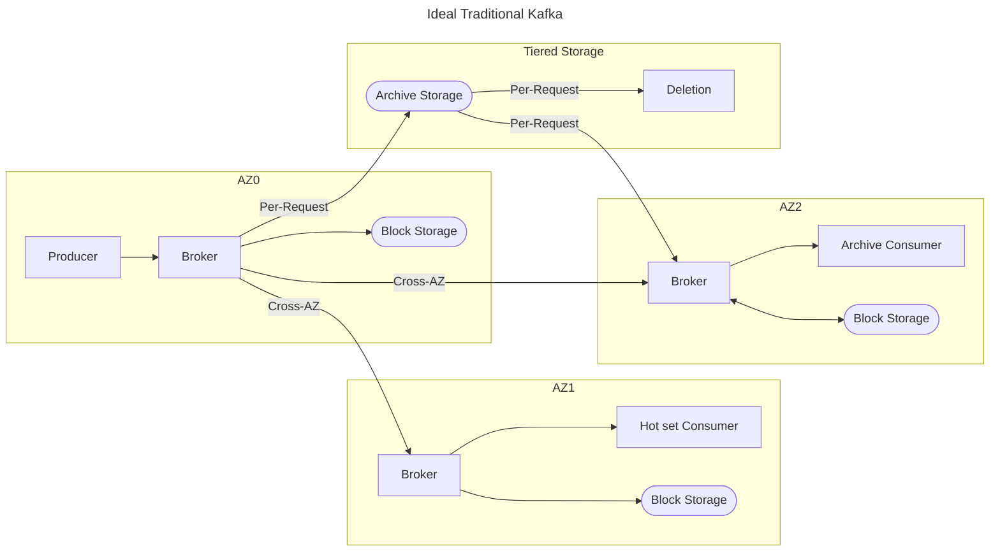
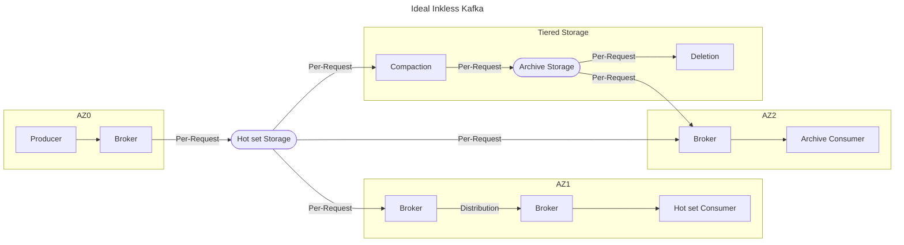

# Cost comparison assumptions & framework  

This document lays out the "ideal" usage pattern for each implementation which minimizes TCO.
This ideal usage pattern includes optimal placement and layout of producers, leaders, and replicas.
It also includes optimal cache hit rates by assuming caches are suitably large for all low-latency consumers.
High-latency consumers are assumed to be limited in number, and require reading from archived data.

## Parameters

These are inputs which affect the cost calculation, including major tuning parameters, hardware capabilities, and pricing.

* Number of broker instances
* Number of archive consumers
* Throughput gb per instance-month
* Total size in gb of hot set
* Total size in gb of archive
* Block size for hot set
* Block size for archive

* Cost per instance-month for compute
* Cost per gb-month for object storage
* Cost per gb-month for block storage
* Cost per request for writing object data
* Cost per request for reading object data
* Cost per request for deleting object data
* Cost per gb for cross-az traffic

## Common Costs

These are costs which are present regardless of the implementation, and can be analyzed separately.

* 3 controllers
* 3 traditional brokers for consumer offsets, transactions, etc
* Client metadata, Cluster metadata
* Data storage cost for archived data
* Object API costs for writing archived data 
* Object API costs for reading archived data
* Object API costs for deleting archived data

## Traditional Single-Region Kafka

These are costs which are only present for a traditional Kafka cluster.

* 3x block storage cost for hot set
* 2x cross-az cost to replicate data

Note: This requires "zonal topics/zonal producers", which requires user architecture changes to optimize producer writes.
This also uses the consumer rack-awareness/fetch-from-follower functionality.

## Ideal Single-Region Inkless

These are costs which are only present for an Inkless Kafka cluster.

* 1x Object storage cost for hot set
* 1x Object API cost for writing hot set
* 2x Object API cost for reading hot set
* 1x Object API cost for deleting hot set

The bandwidth of an inkless broker needs to have capacity for:
* Client Produce requests
* Writing to Hot Set
* Reading from Hot Set
* Writing to archive storage
* Reading from archive storage
* Making Fetch requests to other brokers
* Filling Fetch requests from other brokers
* Client Fetch requests

