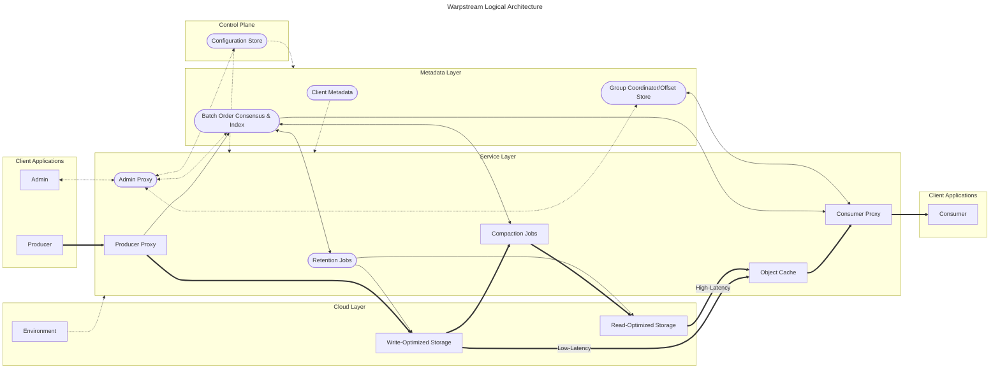
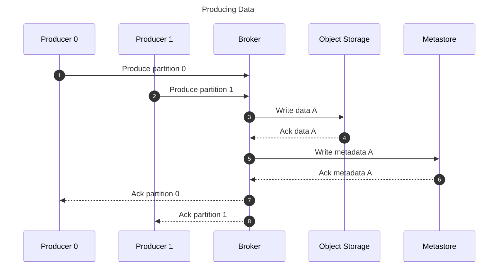
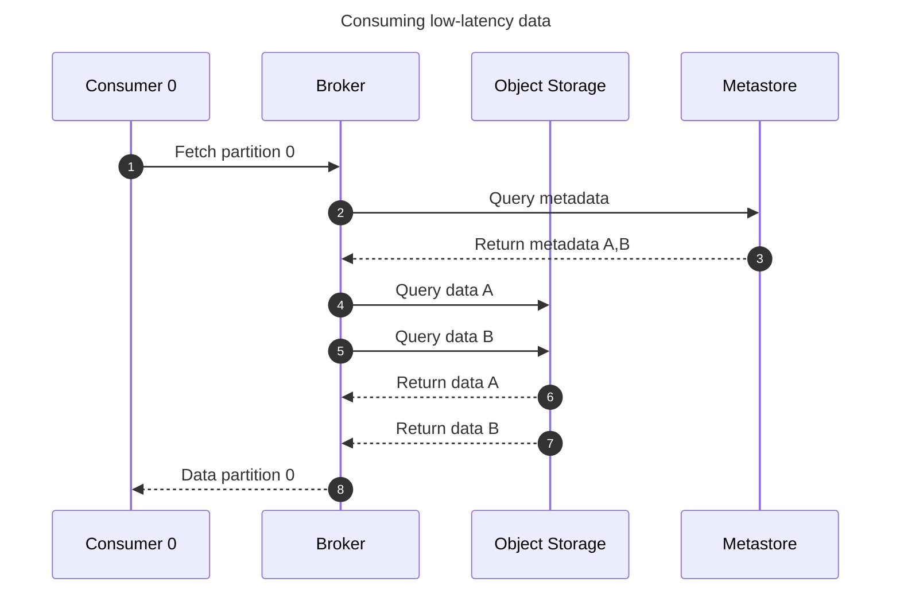
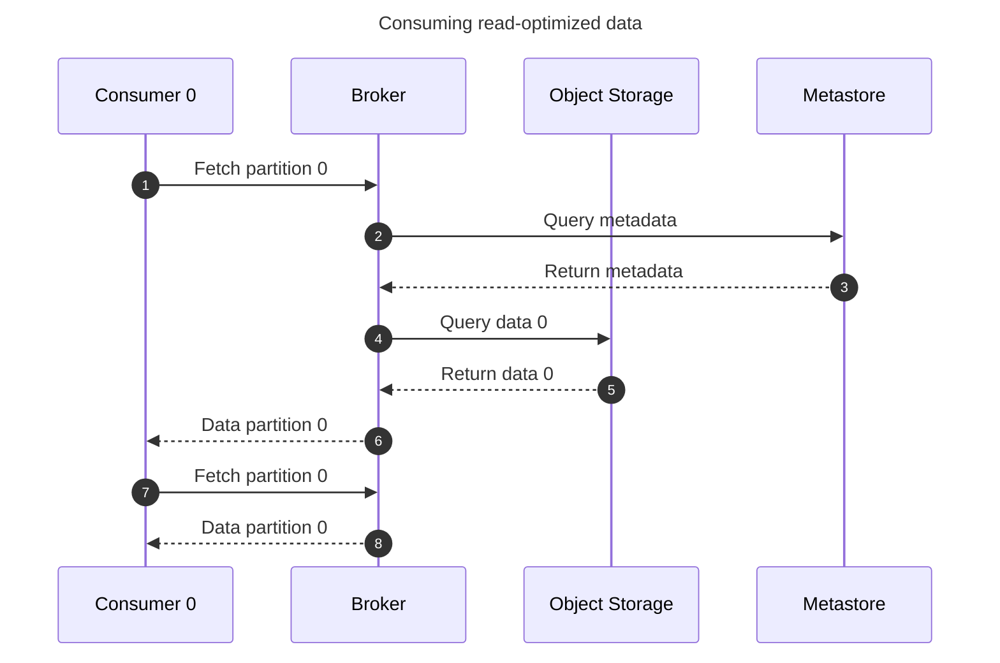

* Thick arrows are data flow, proportional to total throughput
* Thin arrows are batch metadata, proportional to producer/consumer batches
* Dotted arrows are control-plane operations, proportional to infrastructure changes
* Rectangular nodes are explicitly mentioned in public documentation
* Rounded nodes are inferred to exist but are not mentioned in public documentation

