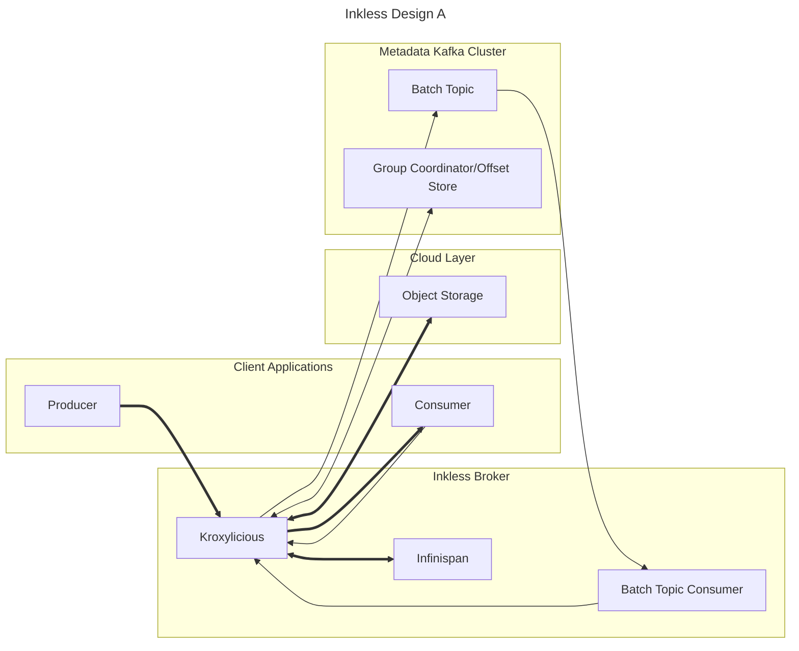

Status: REJECTED due to [ADR for Inkless Implementation](ADR-InklessImplementation.md)

# Explanation

This design prioritizes reusing off-the-shelf components and requiring the least new software.

Inkless brokers are Kroxylicious proxies with custom filters.
Each inkless broker has an in-process Infinispan member for caching Object data.
Multiple Infinispan members cluster together to share data.

A Kraft 3-node Kafka cluster is allocated as the Metadata store.
Group coordination and consumer offsets are naively passed through the proxy to the backing Kafka.
Kroxylicious should already manage the client metadata, to cause produce/fetch requests to target the proxy directly.

The produce filter in Kroxylicious will delay the request to batch it together produces from other clients.
After batching together multiple produce requests, the produce filter will append their data together into a single object.
The index for the object (where each batch is present) will be collected and serialized.
Once this object is written to Infinispan and the Object storage, the index for the object will be written to the Batch Topic.

The Batch Topic Consumer will be constantly reading to the end of the batch topic.
As object indexes arrive, it will populate an in-memory view of each topic.
Once an appended index is read by the consumer, the offsets for the produced records can be determined.
Acks for produced data can then be delivered to the original Producer.

Fetches will be served by looking up in the batch view, looking into the Infinispan cache, and then finally requesting data from Object storage.
Once an object is loaded from Object storage, it is populated in Infinispan and then used to serve the fetch request.
Other consumers fetching the same data can then retrieve data from Infinispan without new GET requests.

Limitations:
* This has substantial dependencies: Infinispan is very mature, but Kroxylicious is pre-1.0.
* There is no compaction or retention async jobs, so a single Fetch may require multiple GETs.
* The single-partition batch topic is a bottleneck.
* Each Inkless broker needs to consume and cache the single-partition batch topic.
* The batch topic has infinite retention and eventually won't fit in Inkless broker's memory.
