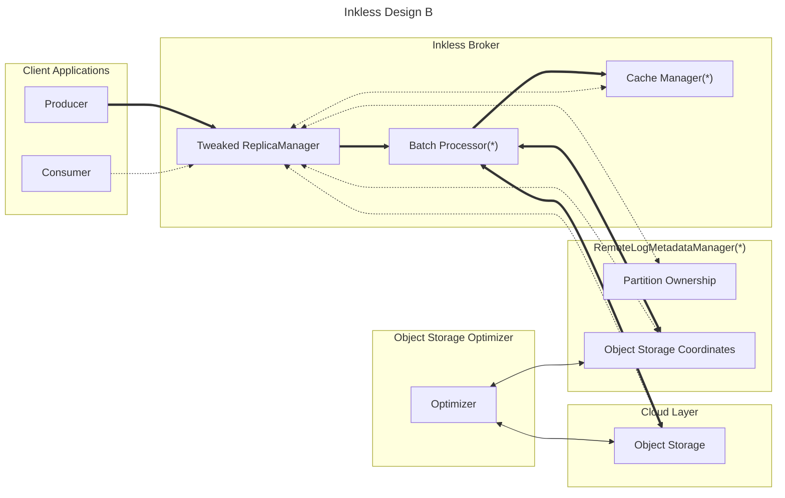
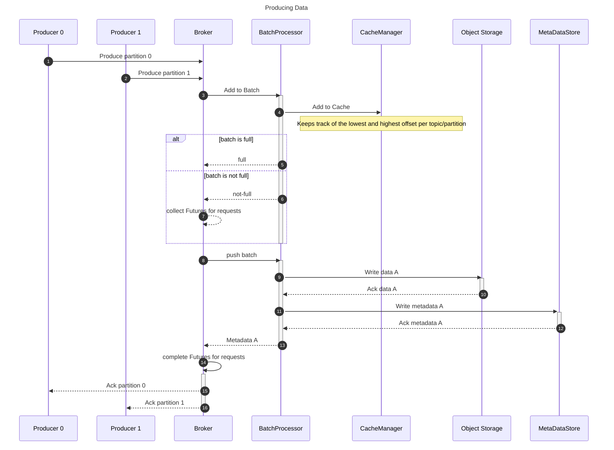
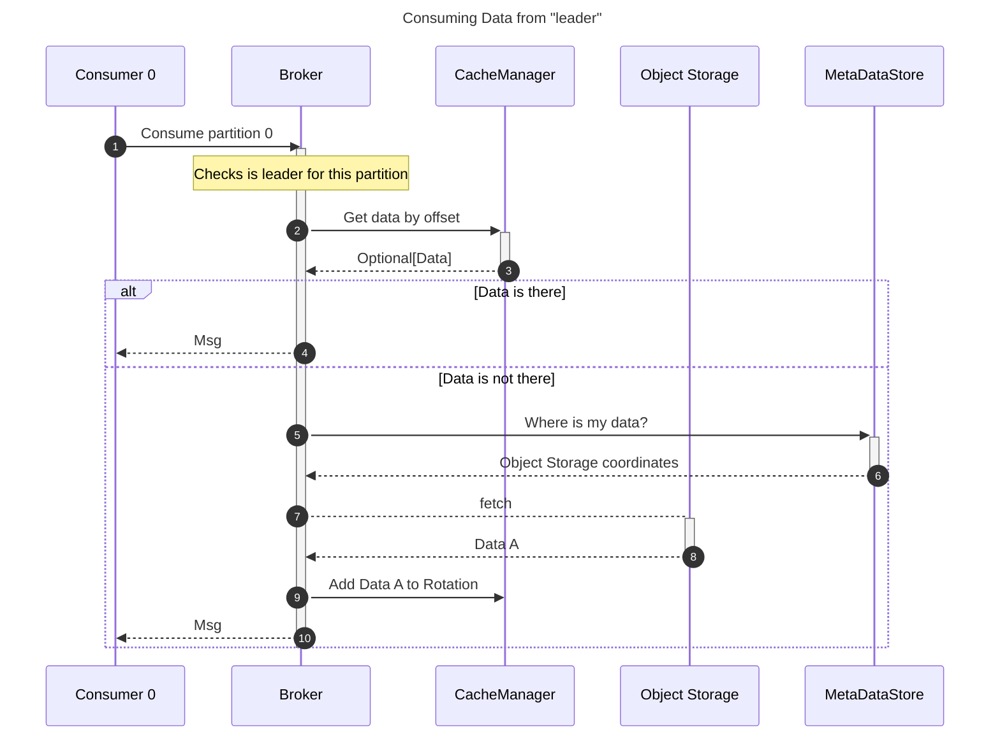
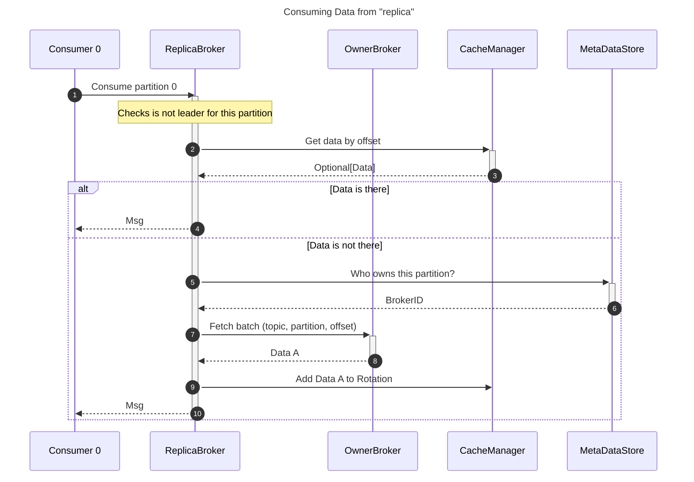

NOTE
> (*) modules may already exist from Tiered Storage components:
> - Batch Processor could be included within the RemoteLogManager
> - Cache Manager: There is some caching already on the TS plugin -- maybe this should be moved to within RemoteLogManager as well?
> - Metadata Store is already available from RemoteLogMetadataManager and could be extended for the new architecture.

This architecture relies on a modified broker and enhances it with a MetadataStore, a CacheManager and a BatchProcessor.
The goal of the CacheManager is to reduce the amount of object storage calls done. It's a limited sized circular cache.
The goal of the batch processor is to group messages to make the upload in object storage efficient in terms of price.
It stores the data in the right object storage and persists its coordinates to the Metadata Store.
This architecture relies on having soft leaders and replicas of partition. Only leaders write to object storage.
The cluster must direct producers to the right broker.

Consumers should be able to read from any broker. If data is in the CacheManager, then return it. If not, if the broker 
is a leader of the partition, it should fetch a batch from Object Storage and populate its cache. Then return the data.
If the broker is not the leader of the partition, it needs to query the MetadataStore and find out who the owner is, then
it can request a batch containing that offset. The leader broker follows the previously described flow and returns a batch.
The follower then updates its cache and returns the data.

If we need to optimize already stored data, this is something that can be done with a scheduler. Data can be read,
reorganized and then update the coordinates.

Brokers joining and leaving the cluster would talk to the MetadataStore to update the PartitionOwnership component.
This component should try to spread the load of writes evenly to maximize the use of the cluster.

