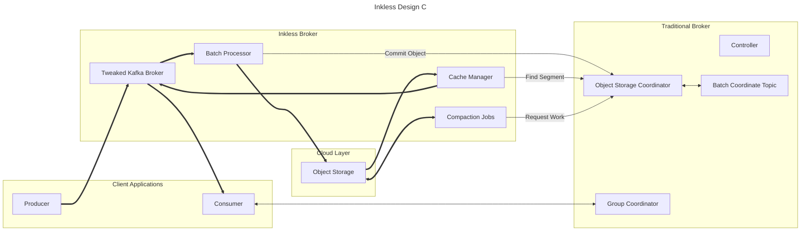
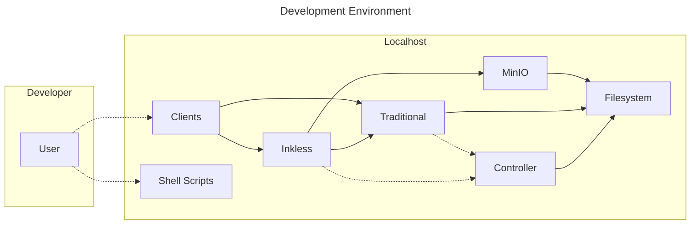
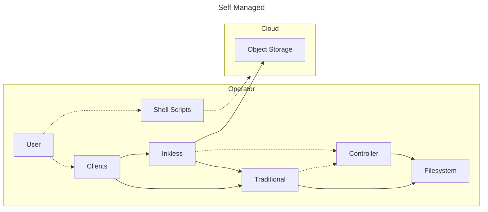
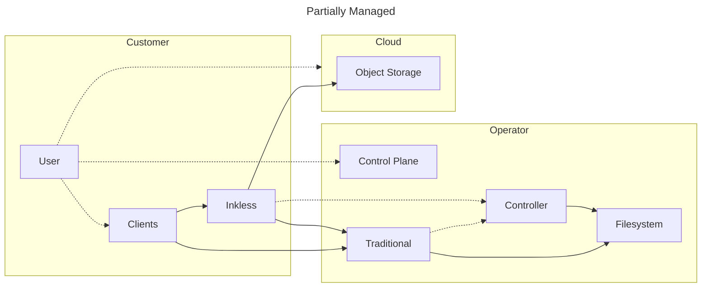
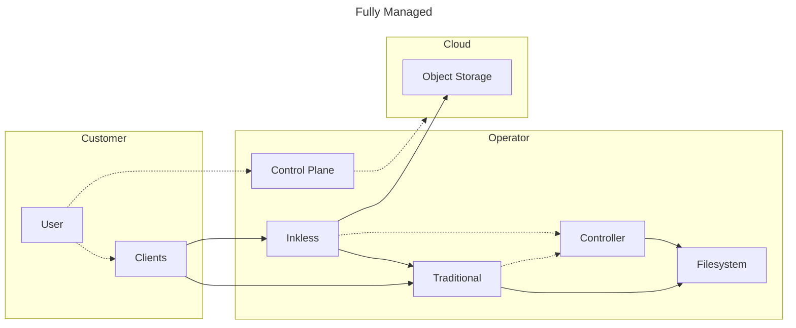

Inkless brokers are a minimally modified broker, participating in normal cluster membership, but cannot host normal topics.
Leadership & replicas for inkless topics are distributed to at least one inkless broker in each AZ, but this leadership is an internal fiction.

In addition to inkless brokers, there is at least one Controller, and at least one traditional broker.
The traditional broker hosts:
* User-facing traditional topics
* Existing internal traditional topics (consumer groups, transactions) 
* Existing coordinators (consumer groups, transactions)
* New "Batch Coordinate Topic" which is a traditional topic containing batch coordinates
* New "Object Storage Coordinator" which maintains a copy of the batch coordinate topic in-memory to serve requests 

The Object Storage Coordinator is modelled after the existing Kafka coordinators.
The coordinator is responsible for maintaining data in-memory, serving requests from other nodes, and persisting state in traditional partitions.
Each coordinator is the leader of its corresponding partition, and handles a subset of inkless partitions.
All batch coordinates for a specified inkless topic-partition are persisted in a single batch coordinate partition.
Multiple inkless topics can share a single batch coordinate partition to amortize their cost.

Producer batches sent to inkless brokers are passed to the BatchProcessor which aggregates them into single objects to upload to Object Storage.
After data has been persisted to object storage, the BatchProcessor makes a request to the object storage coordinator to commit the batches.

When replying to Fetch requests, the kafka broker will consult the Cache Manager.
The Cache Manager is responsible for maintaining and populating an in-memory cache of objects and object coordinates.
If the fetch request does not have suitable coordinates cached, it requests coordinates from the Object Storage Coordinator.
Once the Cache Manager has suitable coordinates, it then knows what objects are necessary to serve the request.
If objects or parts of objects are not in the object cache, they are loaded from storage.
Then the fetch requests can be fulfilled from the cache.

For producers, all inkless brokers are advertised as leaders for all inkless partitions.
This allows any broker in any AZ to accept write traffic from any producer, keeping good producer locality.
This also ensures that producers only need to talk to a single Kafka broker to produce data.
They are not advertised as leaders or replicas for any traditional topics.

For consumers, inkless brokers only announce themselves as replicas for partitions that they are replicas for in the internal cluster metadata.
This allows for better cache hit-rates as each broker is only responsible for storing a subset of the cache. 

Each inkless broker also starts a number of low priority background job threads.
Job threads continuously reach out to the Object Storage Coordinator to find and claim compaction work.
Once compaction work is complete, the Object Storage Coordinator is notified, and the batch index is atomically updated and the job deleted.
If a piece of compaction work is allocated, but the thread later goes offline without completing it, after a timeout it can be re-claimed by another job.

Limitations:
* Without inter-broker gossip/distributed mmap/distributed cache, consumers must maintain multiple broker connections
* Some nodes in the cluster must have attached disks to store the batch coordinates, consumer offsets, etc 
* Clients must have network access to traditional brokers to interact with group coordinator
* Requires 3 new Kafka APIs, which could later conflict with upstream request IDs
* Partition count of Batch Coordinate Topic influences ultimate scalability of the cluster, or we need a resize strategy.
* Election of Batch Coordinate Topic Leader could affect availability of many inkless topics 

## Deployment Models

For internal and external developers working on the Inkless feature, all components should be runnable on a single machine.

For non-customers which want to utilize Inkless clusters, a basic set of shell scripts should permit operating on multiple machines.

For customers which want to keep data transfers within their cloud accounts, they may run Inkless brokers on ephemeral machines, which contact a managed backing Kafka cluster.
Customers may run "embedded" inkless brokers within their applications, or a kubernetes-managed cluster for multiple applications.

For customers that want fully managed inkless clusters as-a-service, Operators can host all services on their behalf.

