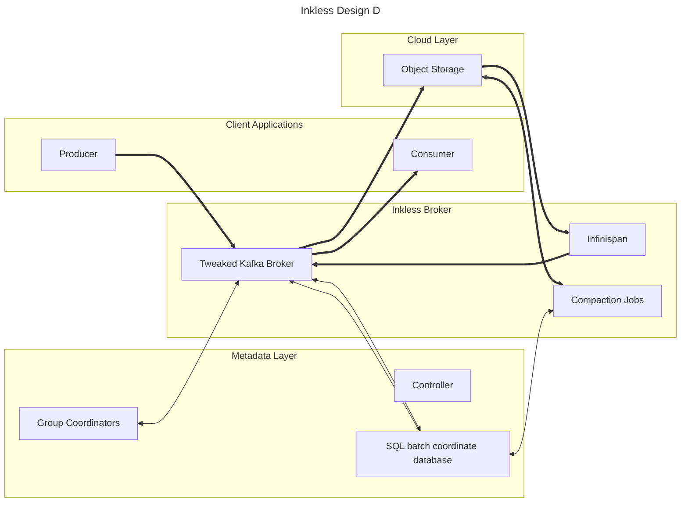

In this design, clients connect to a slightly modified Kafka broker.
This kafka broker is part of a cluster, with controllers in the metadata plane.
This cluster hosts only internal topics, such as consumer offsets.

Data is handled similar to other solutions.
Batch coordinates are persisted to a SQL database, and each broker has a single connection to the backing database.
Requests to commit batch data, lookup batch data, and perform compaction jobs are served by executing SQL queries.

Infinispan is used to provide a distributed embedded cache to all nodes in a single AZ.
Producers and Consumers only need to maintain one connection each, and receive spoofed client metadata.
