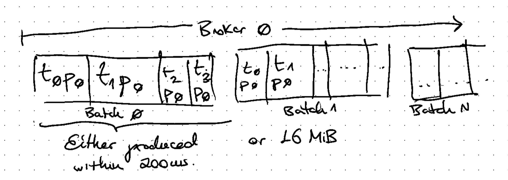
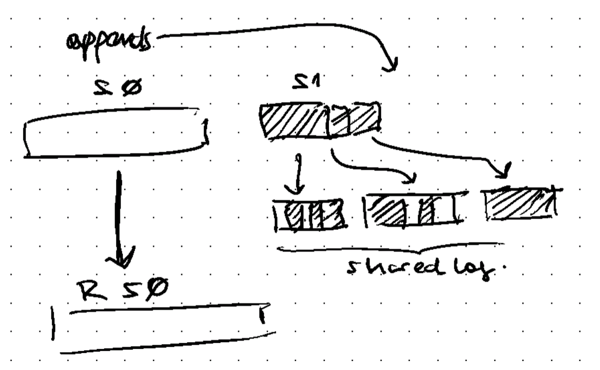
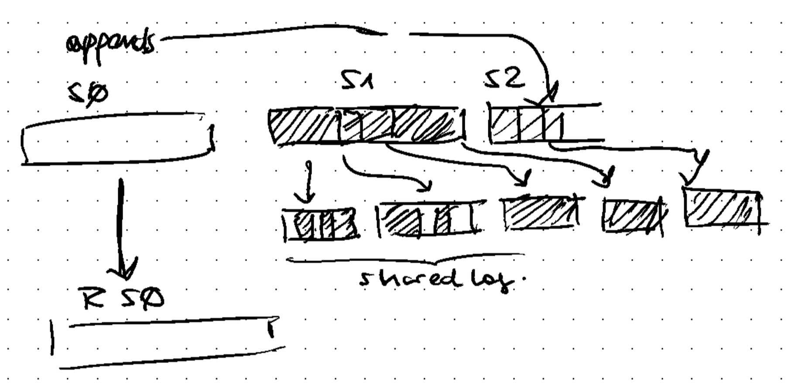
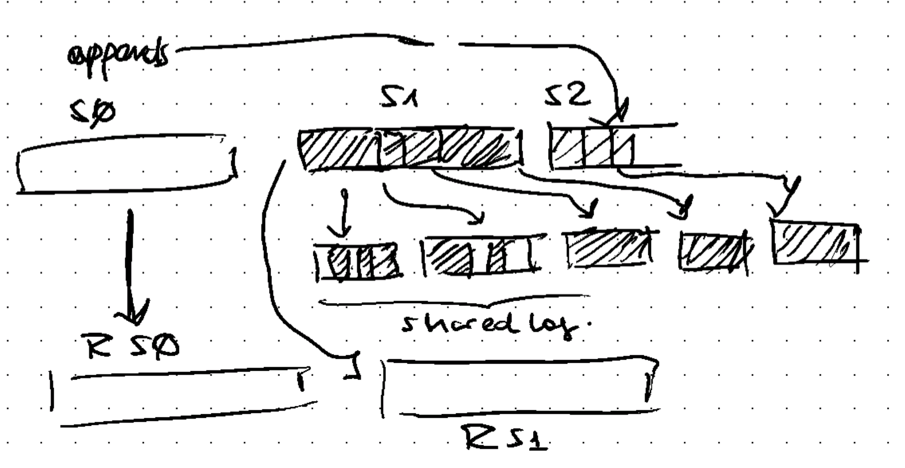
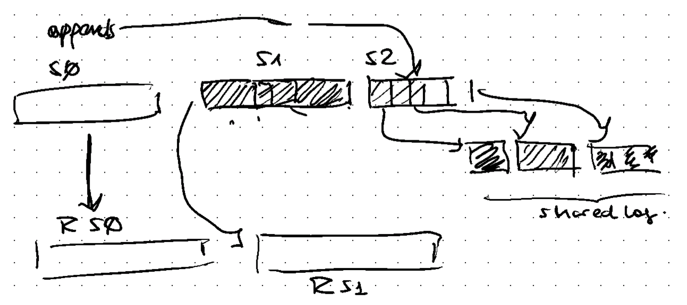
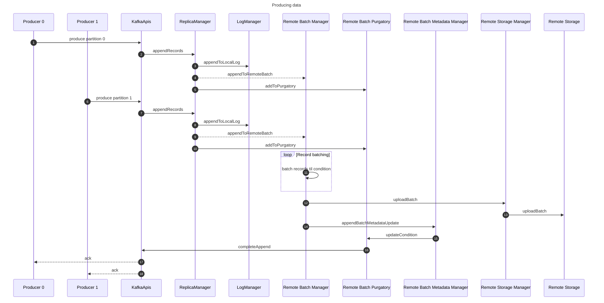
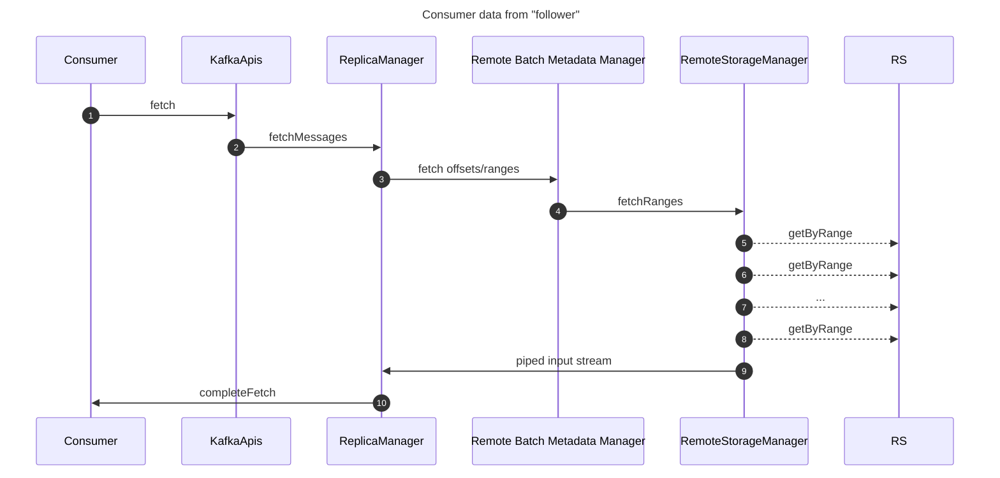
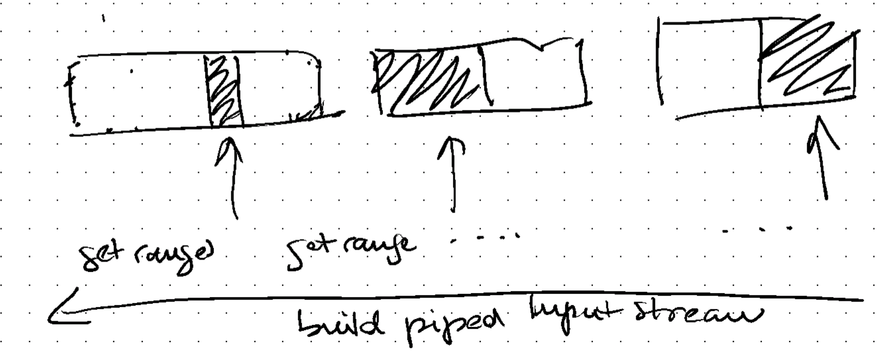

# Proposal E

Goals:
- No additional dependencies
- Reuse existing components when possible
- Minimize requests costs
- Eventually easier to upstream
- Compatible with Tiered Storage

## Data format

Kafka topics have a established data format based in Record batches appended to a local file.
Alongside the Log, indexes are built to access records efficiently.
With tiered storage, the rotated segments and its indexes are uploaded to a Remote Storage.

For Inkless topics, Brokers will keep a local file for the Active Segment as it currently does;
while keeping a shared log of record batches remotely, containing Record batches from the replica leaders.

These shared log batches are rotated based on time and space configurations.
The goal of these batches is to define a fixed upload rate per broker and amortize remote upload costs.

These shared log batches are temporal: They are only kept until all of their records are uploaded as part of regular tiered storage.

When appending to the active segment, the partition records are added to the shared log batch.
These log batches can contain records from multiple partition where the broker is leader for.

When the active segment is rotated and a new segment is opened, the same mechanism continues.

As in regular Tiered Storage, background process uploads the rotated segment for all the partition leaders;
and the metadata confirms that data from shared logs are already available on the tiered segment, 
then the shared log batches are candidate for deletion.

Metadata from the Remote Log Batch must be stored in a metadata topic to keep track and share placement across Kafka brokers.

## Write path

### Selecting a Partition Replica Leader

Ideally, the Replica Leader placement is aligned with the Producer AZ.
Inkless topics could progressively add support for this.
Though, regular placement (random) may be enough for the first stage.

We need to gather feedback on what scenarios the leader placement may optimize for. 
Arguably, we could assume a single producer would be place on any AZ, and the leadership shuold move accordingly, but this needs more study.

### Writing to a Replica Leader

Assuming a Replica Leader has been assigned to a broker, the write path would flow as follows:

Existing components: 
- KafkaApis, ReplicaManager, LogManager: these components should be minimally changed to add the conditional path for inkless topics.
- RemoteStorageManager: existing API to interact with Remote Storage
- Remote Storage: e.g. S3.

New components:
- Remote Batch Manager: this is the key component enabling the Broker to upload records from multiple active segments as part of shared batches to Remote Storage.
- Remote Batch Purgatory: a new purgatory to wait for metadata from Remote Batch upload to become available to acknowledge producers.
- Remote Batch Metadata Manager: a component to manage batch metadata lifecycle.

## Read path

### Reading from Replica Leader

Reading from a replica leader should be as-is, using local segment files as source.

### Reading from Follower

To allow Consumers from different AZs from the Replica Leader to fetch data from the active segment, 
a Broker per AZ must be assigned as _Remote Follower_.

A Remote Follower is a Follower that does not participate on ISR, and only serve as proxy for data available on Remote Storage.

Given that partition records may be spread along many record batches, 
the Follower will use the remote batch metadata to build the remote object ranges where to fetch from.
These fetch requests can be concatenated to be served to consumer.

Remote fetching could be optimized to eagerly fetch many ranges in parallel to serve consumers as soon as possible.

There will be at most 1 range per batch: either the whole batch is from a single partition, or it is along other partitions data.

e.g. if the batch rotation is 200ms, there may be 5 batches to read from per second, meaning 5 GET requests per second.

## Cleaning batches

There is no need to compact batches, as brokers will already have a separate log per partition already. 
When those logs are rotated and Tiered Storage uploads them, then the remote batches will become irrelevant and can be deleted.
This could be included into the Cleanup tasks.

