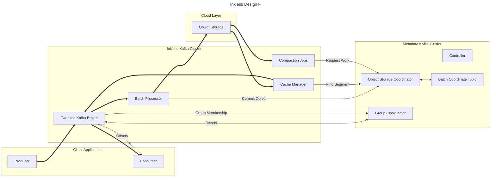

This design prioritizes multi-tenancy, where one controller quorum can serve multiple Inkless clusters.
It also allows for inkless clusters to be truly diskless, by pushing all traditional topics into a central cluster.

Similar to Proposal C, except:

Inkless brokers are a modified broker, completely unable to host traditional topics.
Inkless brokers communicate membership among themselves by contacting the Group Coordinator of a Metadata Kafka Cluster.
This Kafka cluster has only traditional topics, but there are internal topics used by the inkless implementation.

There is only one controller quorum for multiple Inkless clusters.
Each Metadata Kafka Cluster can have multiple Batch Coordinate Topics, each one for a single Inkless cluster.

Consumers will be proxied back to the Metadata Kafka Cluster.
There can be multiple sets of Group Coordinators and __consumer_offsets topics, each one for a single Inkless cluster.

There will be per-inkless-cluster __metadata topics storing the data for the Inkless cluster.
Inkless brokers will consume from this topic to get information about the available topics, users, acls, etc.
The Metadata broker elected leader will operate as a controller, accepting admin calls proxied from Inkless brokers.

Limitations:
* Unavailability of the Metadata Kafka can cause unavailability of many Inkless clusters.
* Refactoring to support multiple/remote __consumer_offsets and __metadata_topic instances will be complicated.