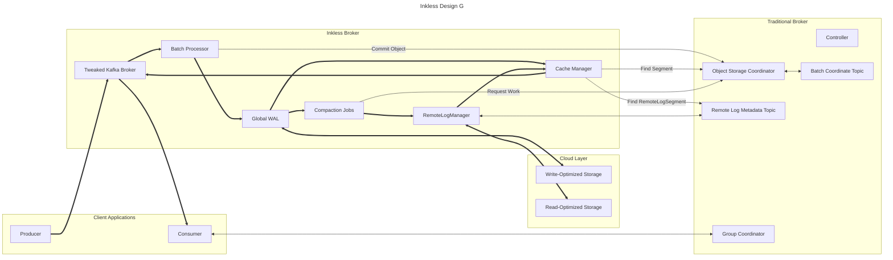

Similar to Proposal C, except:

Rather than compacting data into the same format, compaction jobs build segments in the existing format.
These traditional segments are then moved to cloud storage using existing RemoteLogManager implementations.

This allows easy onboarding of existing tiered storage topics by just changing the way local log segments are written.
Improvements to the tiered storage feature will automatically benefit this new deployment style.
This is a good idea if the same sorts of people that want high latency 0-cross-az also want very long retention and so are already using tiered storage.

Data retrieved from the RemoteLogManager by the CacheManager is available to all brokers in an AZ.
The Global WAL is an abstraction like the RemoteLogManager, providing offset-less storage and retrieval of data.
Tiered storage plugins would provide a Global WAL implementation to provide this functionality on a particular backing store.

A trivial implementation of the Global WAL implementation could use the local filesystem for single-broker clusters.
The layout of the Global WAL files in the filesystem could be controlled by the plugin implementations.

Limitations:
* Compaction could be more expensive, or require leaky interfaces.
* Two different sources of truth on segments: the object storage coordinator for low-latency data and the RLMM for high-latency data. 
* By using a single-partition file format, object storage API costs can scale with the number of partitions for very small partitions. 