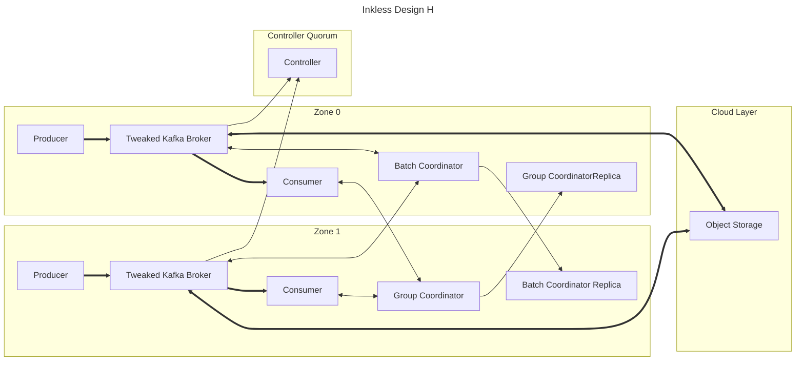

Similar to Proposal C, except:

There are no distinguished "Inkless Brokers" and "Traditional Brokers."

All brokers are expected to have persistent disks for storing metadata.
Cluster metadata is persisted by a controller quorum, and batch coordinates, consumer offsets are persisted durably across AZs via replication.

One Inkless broker is elected leader for each partition, and hosts the batch coordinator for that partition.
Other brokers producing to that same topic contact the leader/batch coordinator to choose an ordering.

Limitations:
* All brokers require persistent disks, but they can be much smaller as they only handle metadata.
* Requires outbound connections between AZs to transfer metadata
* Latency for producing to a topic depends on if the leader for that topic is in the same AZ as the producer.
