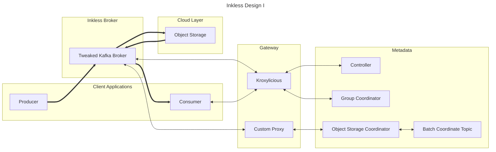

This design is similar to Proposal C, except it provides multi-tenancy without natively adding support for it. 

The backend of the solution is a "Metadata Kafka Cluster" which is managed internally.
Only one controller quorum & group of brokers is provisioned for multiple users.
This amortizes the cost and reduces the provisioning time of a single Inkless cluster.

The Kroxylicious Proxy is used with the "Multi-Tenancy Filter", allowing for one physical Kafka cluster to be exposed as multiple virtual clusters.
Each virtual cluster has a separate namespace for the resources that are actually provisioned on the physical kafka cluster.
The Multi-Tenancy Filter is extended to also support multi-tenant controller APIs, to allow for brokers to be provisioned in front of the proxy.
A Custom proxy is written to perform the same operations as the Kroxylicious proxy, but without requiring modifying the Kafka protocol pre-upstreaming.

Kroxylicious can accept custom filters that allow for authorization, quotas, etc.
The custom proxy can be utilized for billing of Inkless data storage and retrieval.

Limitations:
* Requires investment into the "preview" multi-tenancy filter, to stabilize it for production usage.
* Requires an additional proxy to be used for non-kafka traffic before upstreaming.

