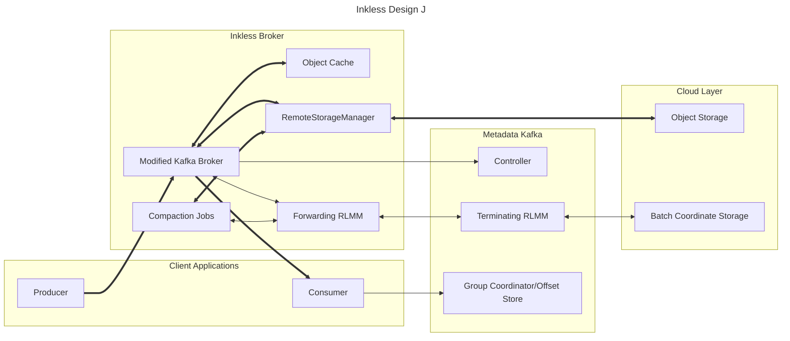
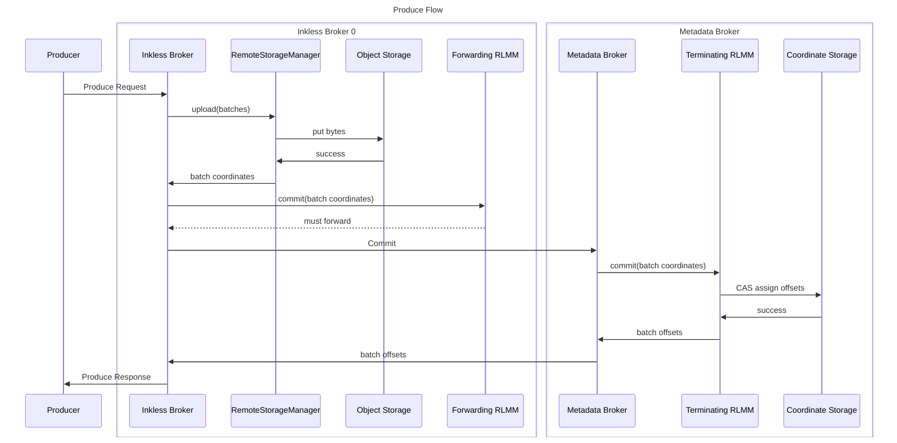
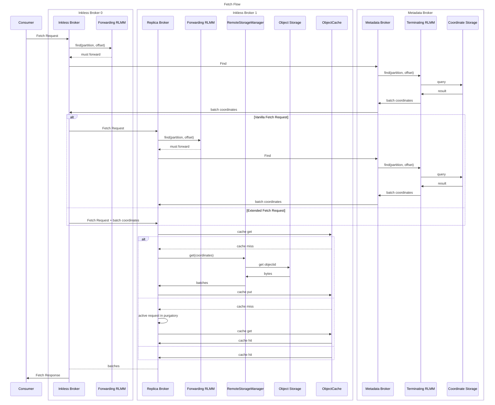
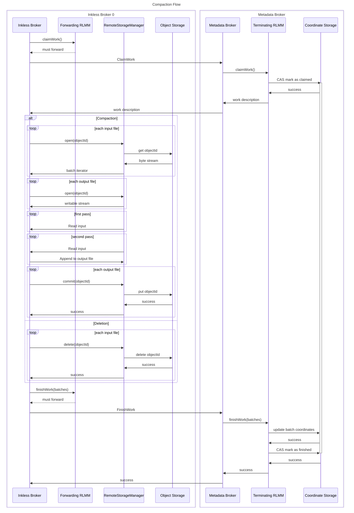

This architecture makes use of request forwarding from the pluggable RLMM on the Inkless Broker to another pluggable RLMM on the metadata Kafka cluster.

The RemoteLogMetadataManager and RemoteStorageManager interfaces are extended or replaced with new interfaces allowing for write-before-commit and multi-partition batching.

The RemoteStorageManager calls are always completed on the local machine.
Requests must be made or redirected to the intended machine before calling.

The produce flow is the most straightforward, because it doesn't involve multiple inkless brokers.

Because a unique broker in each zone is given responsibility to perform the GET request for an object, other brokers must know what object contains the data for their fetch request.
Because multiple topic-partitions/offsets may be present in a single object, finding the object ID for a fetch request requires contacting the coordinate storage.
This means that Fetch requests will always need to query the coordinate storage to find the responsible broker.

If we use the vanilla Fetch request to perform cross-broker data requests, then the target broker will need to make a second request to find the object coordinates.
This may be good from a security/correctness perspective: each broker will get the freshest object coordinates from their assumed-safe RLMM.
But when the requests are forwarded, this will add latency to fetch requests for additional round trip to the metadata cluster.
This can be avoided if we augment the Fetch request to include the already-looked-up batch coordinates as a hint.

Each block of object storage is also placed in a local in-memory cache.
Requests for the same block of object data are deduplicated and subsequent requests are placed in purgatory.
Requests after the cache is populated can serve the cached data directly.

Abstractions for compaction are delicate: The file needs to be structured to allow easy iteration over the records, but without potentially having to share a Java representation like MemoryRecords/FileRecords/etc.
Compaction could also take full responsibility for the data format, and the RSM could provide byte-level data and iterators.
