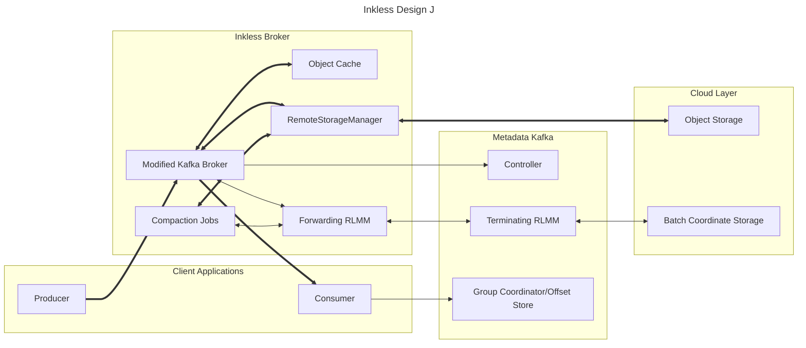

This architecture makes use of request forwarding from the pluggable RLMM on the Inkless Broker to another pluggable RLMM on the metadata Kafka cluster.

The RemoteLogMetadataManager and RemoteStorageManager interfaces are extended or replaced with new interfaces allowing for write-before-commit and multi-partition batching.
